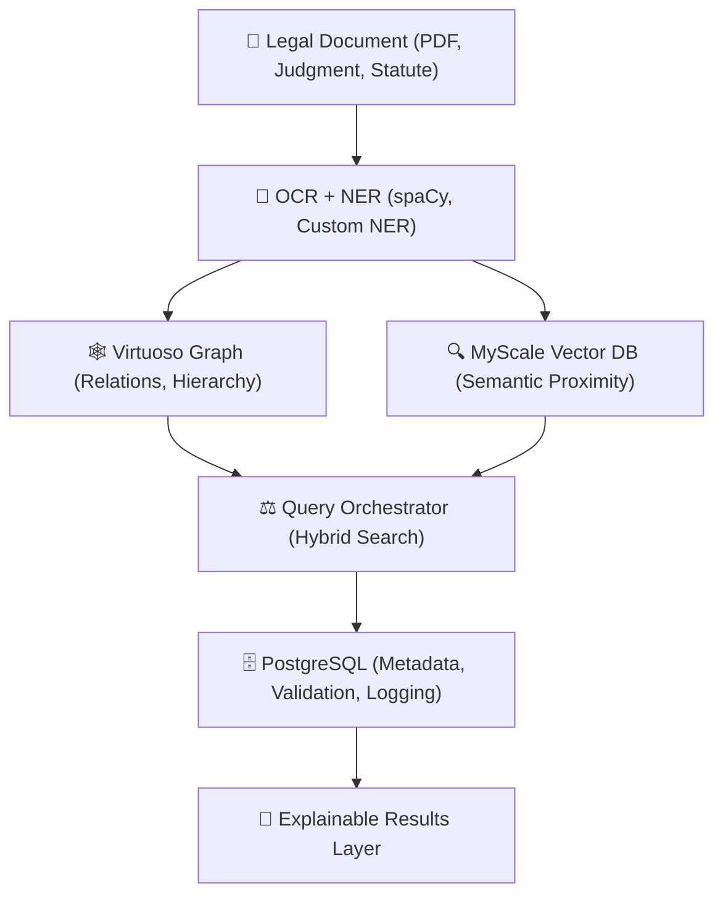

import { Code } from 'astro-expressive-code/components';


import OptImg from '../../components/OptImg.astro'

*When Three AI Tools Missed Three SCOTUS Decisions: A Technical Post-Mortem*

**A roadmap to build explainable legal AI using Virtuoso, MyScaleDB, PostgreSQL, and Phi-4.**

---

> **Context**: This article follows [Why Current Legal AI Fails](https://www.village-justice.com/articles/recherche-juridique-pourquoi-actuelle-echoue-comment-rendre-intelligente,55107.html) (in French) and [From Retrieval to Reasoning: Rebuilding the Grammar of Legal Intelligence](https://en.benchwiseunderflow.in/blog/ethical-legal-search/), which detailed the philosophical failures. This is the technical implementation.
---

Law isn't a pile of documents—it's a living web of meaning. A jurist doesn't ask "where does this word appear?" but "what principle connects this case to that statute?"

In previous work, I've argued that legal AI tools often reproduce bias, opacity, and epistemic shortcuts—automating the appearance of reasoning without its substance. This article is different. It's **the implementation blueprint**—the bridge between legal philosophy and backend engineering. Here’s how to build an AI-assisted search engine that not only ranks results — but explains why they matter.

Because justice doesn't need faster queries—it needs **traceable reasoning**.

---

## I. The Day Legal AI Missed the Supreme Court

*November 2024. I had a personal legal matter to prepare.*

I opened three legal AI tools—the ones that promise "augmented search," "predictive analytics," "semantic intelligence." I entered my question. All three returned dozens of results, neatly formatted, with confidence scores hovering near 90%.

Four hours later, after exhausting Google Scholar and legal databases, I found **three Supreme Court decisions**.

Not district court rulings.  
Not even Circuit Court opinions.  
**Supreme Court of the United States.**

The decisions that settle the law.  
The precedents that bind every court in the country.  
The rulings no AI tool should ever miss.

None of the three tools found them.


### This isn't a bug. It's epistemic collapse.

Imagine the equivalent in other domains:

- A drug interaction checker that **misses FDA black box warnings**
- A financial compliance tool that **ignores SEC enforcement actions**
- A code security scanner that **skips CVEs in the NIST database**

We wouldn't call that "incomplete results." We'd call it **systemic failure**.

Yet in legal tech, we've normalized this failure. We've even marketed it as a feature: "Thousands of results in seconds!"

**But what good is speed if the compass points south?**

### Three decisions. Three modes of invisibility.

Why were these Supreme Court decisions—the **most authoritative sources in US law**—invisible?

#### Decision 1: The illusion of synonymy

**The problem**: The Court used terminology from an international treaty to refer to a constitutional principle. Same legal concept, different wording.

**Why it was missed**: Semantic embeddings treat law like natural language. They calculate "proximity" between terms. But in law, there are no synonyms—only **hidden identities beneath different formulations**. "Best interest" and "paramount consideration" aren't "close"—they're **the exact same legal standard** (UN Convention on the Rights of the Child → 14th Amendment doctrine).

**What this reveals**: RAG systems confuse syntactic similarity with conceptual identity.

#### Decision 2: Temporal amnesia

**The problem**: The decision cited a statutory provision in a version that had been amended by Congress since then.

**Why it was missed**: Vector databases have no notion of **version** or **identity through time**. When you search for "42 U.S.C. § 1983," you get either the current version or nothing. But a 2019 decision citing the 2016 version remains relevant in 2024—because it interprets the **underlying principle**, not the letter.

**What this reveals**: Law evolves through time, but embeddings are frozen in the moment.

#### Decision 3: The authority gap

**The problem**: This decision **affirmed without opinion**—it didn't create new doctrine, just validated the lower court's reasoning.

**Why it was missed**: Legal ranking algorithms (PageRank-style) score cases by **citation count**. A summary affirmance is perceived as a "non-event" algorithmically: no new doctrine, rarely cited, therefore unimportant.

But legally, **a Supreme Court affirmance has the same precedential weight as a full opinion**. When SCOTUS says "we affirm," it validates the reasoning below. That validation **is** the law.

**What this reveals**: Systems confuse popularity with authority.

### The real problem: law isn't a corpus

These three failures aren't bugs. They're **symptoms of a fundamental architectural error**.

Current tools treat law as a **retrieval problem**:
1. Index lots of documents
2. Calculate their semantic proximity to the query
3. Return the closest matches

But law doesn't work that way. Law is a **reasoning system**:
- A decision matters not for its words, but for the **principle it establishes**
- A statute matters not in isolation, but through its **relationship to other statutes**
- A precedent matters not by its popularity, but by its **position in the hierarchy**

> Law is a **graph of meaning**, not a pile of text.  
> And as long as we treat it as text, we'll miss Supreme Court cases.

### What follows: the system I had to build

This article isn't a critique.  
It's the **blueprint of the system I built** to never miss a Supreme Court case again.

A system where:
- **Virtuoso** models legal structure—hierarchy of norms, text versions, conceptual identities
- **MyScaleDB** captures semantic proximity—but constrained by legal ontology, not natural language
- **PostgreSQL** traces every inference—so a judge can audit the reasoning
- **Phi-4** extracts principles—not just keywords

Not to replace the lawyer.  
But so they don't lose four hours finding **what should have been the first result**.

Because in my case, it was a personal matter.  
But for a lawyer who misses an appeal deadline because a tool forgot a Supreme Court case?

**That's not a bug. That's malpractice, AI-assisted.**

## II. Why Legal AI Misses the Supreme Court

### Three architectural blind spots in commercial legal AI

These failures aren't anecdotal. They reveal three **structural flaws** present in every legal AI tool I tested.

#### 1. Lexical frequency bias

RAG systems rely on embedding models trained on general-purpose text. When you ask for "best interest of the child," they search for documents containing those words or their "semantic neighbors."

The problem? In law, **concepts are not word clusters**.

<Code code={`# What the embedding calculates:
semantic_distance("best interest", "paramount consideration") 
→ 0.27  # "Moderately close"

# What a lawyer knows:
are_legally_identical("best interest", "paramount consideration") 
→ True  # Art. 3 UNCRC = Constitutional standard
`} lang="python" />

A decision can be **perfectly relevant** while being linguistically "distant". Embeddings don't capture **legal equivalences**—they calculate statistical averages over text corpora.

**Result**: A Supreme Court case using treaty language to describe a constitutional principle becomes invisible.

#### 2. Temporal amnesia of vectors

Vector databases treat each version of a text as an independent document. They have no notion of **identity through time**.

<Code code={`-- What a vector system stores:
Document_1: "42 U.S.C. § 1983 (2016 version): Civil action for deprivation..."
            → embedding_A

Document_2: "42 U.S.C. § 1983 (2022 version): Civil action for deprivation..."
            → embedding_B

-- Problem: embedding_A ≠ embedding_B
-- So a search for "section 1983" only finds the current version
`} lang="sql" />

But legally, **a case citing a repealed statute remains relevant** if it interprets the underlying principle. A 2019 decision citing the 2016 version of a statute can be THE reference in 2024—even if the text was amended.

Vector systems don't know this. They treat each version as an isolated entity.

**Result**: Once a statute is amended, all prior case law becomes partially invisible.

#### 3. Confusing legal authority with citation authority

Legal ranking algorithms use PageRank-style metrics: a document is important if it's cited often.

<Code code={`# Typical legal search engine scoring:
score(case) = (citation_count × 0.4) + 
              (court_level × 0.3) + 
              (semantic_relevance × 0.3)

# Problem for a summary affirmance:
citation_count → Low (no "new" doctrine)
court_level → Maximum (Supreme Court)
semantic_relevance → Variable

# Final score → Medium or low
`} lang="python" />

But **a summary affirmance has the same precedential weight as a full opinion**. When SCOTUS says "we affirm," it validates the lower court's reasoning. That validation **is precedent**.

Algorithms only see a "non-event": no reversal, no new principle, therefore unimportant.

**Result**: The most authoritative cases can be the least visible.

### Why this is even harder in Common Law

In civil law systems (France, Germany, Japan), the structure is relatively clean:
- Statutes are the primary source
- Case law interprets statutes  
- Higher courts bind lower courts

In common law, it's messier:

**1. No single "code"**—the law is scattered across thousands of cases  
**2. Implicit overruling**—a case can invalidate precedent without saying so  
**3. Circuit splits**—two appellate courts can say opposite things (both binding in their circuits)  
**4. Dissenting opinions**—a minority view can become majority law decades later  

These complications make the graph **exponentially more complex**.

An AI that misses a Supreme Court case? **Malpractice-grade negligence.**  
An AI that misses a circuit split? **You just lost the appeal.**

### The real cost of these blind spots

These flaws aren't theoretical. They have direct consequences:

- **For lawyers**: Time lost, arguments missed, risk of sanctions for incomplete research
- **For litigants**: Decisions made on incomplete legal foundations
- **For trust**: If AI misses Supreme Court cases, what else is it missing?

And the worst part? **These tools never signal their limitations**. They return results with high confidence scores, without mentioning they may have missed the most important case.

> In medicine, this is called a **false negative**. In law, it's called **failure to research**.

### When retrieval failures kill

Imagine a doctor searching for a drug in the Physicians' Desk Reference. The system returns 47 results—but misses the one that saves the patient because it ranked by popularity, didn't recognize a generic name, or ignored a critical reformulation.

The patient dies. Not from lack of knowledge. From a search failure.

In law, the stakes are identical.

A missed Supreme Court case doesn't just lose an argument.  
It can mean a child placed with an abusive parent.  
An innocent person imprisoned.  
A refugee deported to danger.

**When legal search fails, people die.**

## III. Rethinking Legal Search as a Graph Problem

### Law as a formal system

To solve these three blind spots, we need to stop treating law as a document corpus.

Law is a **formal system** with:
- An **ontology**: legal concepts have stable identities
- A **temporality**: texts evolve but principles persist
- A **hierarchy**: authority isn't measured in citations

What we need is an architecture that models these three dimensions:

**Virtuoso** for reasoning graph → captures ontology and hierarchy  
**MyScaleDB** for semantic proximity → constrained by legal ontology, not natural language  
**PostgreSQL** for traceability → every inference is audited  
**Phi-4** for extraction → identifies principles, not keywords

### Why a graph?

A case doesn't exist in isolation. It exists through its relationships:
- *applies* a statute
- *distinguishes* a precedent
- *overrules* an earlier case
- *creates* a new test

These relationships form a **directed acyclic graph** (mostly—circular references do exist, that's another article).

**Example**: Finding all cases that apply the *Chevron* doctrine (before *Loper Bright* overruled it):

<Code code={`SELECT ?case ?year WHERE {
  ?case law:applies law:ChevronDoctrine ;
        law:decidedYear ?year .
  FILTER(?year < 2024)
}
ORDER BY ?year
`} lang="sparql" />

This query is impossible in a pure vector database. It requires **structural reasoning**.

### The three dimensions to model

**1. Structure** (graph database)  
- Hierarchy: SCOTUS > Circuit > District  
- Relations: *applies*, *distinguishes*, *overrules*  
- Temporality: version control for statutes

**2. Semantics** (vector database)  
- Conceptual proximity between cases  
- Guided by ontology, not raw language  
- Example: "qualified immunity" ≈ "good faith defense"

**3. Traceability** (relational database)  
- Every query logged  
- Every inference explained  
- Every result auditable

No single database can do all three. That's why we need **three databases**.

To make reasoning computable again, we first need to visualize how information flows — from legal text to structured meaning.



## IV. Architecture: Three Databases, One Reason

### Overview: Why not one database?

The instinct is to pick one technology and make it work. PostgreSQL with extensions? Neo4j with vector plugins? Just throw everything into Elasticsearch?

I tried all three. Here's why they failed:

**PostgreSQL + pg_vector**  
✅ Great for structured data and ACID compliance  
❌ Vector search on 500k+ documents: too slow (>2s per query even with HNSW indexes)  
❌ No native graph traversal (ltree extension is a hack, not a solution)

**Neo4j + vector plugin**  
✅ Excellent graph traversal  
❌ Vector search is bolted-on, not native (uses external index)  
❌ Cypher can't express legal reasoning patterns without 10+ lines of code  
❌ Licensing costs explode at scale

**Elasticsearch + graph plugin**  
✅ Fast full-text search  
❌ "Graph" support is breadth-first traversal, not logical inference  
❌ Can't model "Article 1983 (2016 version) IS_SAME_AS Article 1983 (2022 version)"

**The realization**: Legal reasoning requires three different computational models:
1. **Logical inference** (ontology, rules) → graph database with reasoning engine
2. **Semantic similarity** (vector proximity) → specialized vector database
3. **Audit trail** (transactions, logs) → relational database

No single tool does all three well. So I used three tools.

### Component 1: Virtuoso — The Reasoning Engine

**Why Virtuoso over Neo4j/GraphDB/Neptune?**

Virtuoso is an **RDF triple store** with a built-in OWL reasoner. This matters because:

**1. SPARQL > Cypher for legal queries**

Compare finding all cases that apply the same principle, across different wording:

Neo4j:
<Code code={`// Neo4j (Cypher) - can't do inference
MATCH (c:Case)-[:APPLIES]->(p:Principle {name: "Best Interest"})
RETURN c
// Misses cases that use "Paramount Consideration"
`} lang="cypher" />

Virtuoso: 
<Code code={`# Virtuoso (SPARQL) - inference built-in
PREFIX law: <http://legal.example/ontology#>

# Define equivalence ONCE
law:BestInterest owl:sameAs law:ParamountConsideration .

# Query automatically finds both
SELECT ?case WHERE {
  ?case law:appliesPrinciple law:BestInterest .
}
# Finds cases using EITHER term via OWL reasoning
`} lang="sparql" />

**2. Temporal versioning via named graphs**

Legal texts evolve. Virtuoso handles this natively:

<Code code={`# Each version lives in its own graph
GRAPH law:USC_1983_v2016 {
  law:Section1983 
    law:text "Every person who, under color of any statute..." ;
    law:validFrom "1871-04-20"^^xsd:date ;
    law:validUntil "2016-03-15"^^xsd:date .
}

GRAPH law:USC_1983_v2017 {
  law:Section1983 
    law:text "Every person who, under color of any statute..." ;
    law:validFrom "2016-03-16"^^xsd:date .
}

# Query for cases citing the 2016 version
SELECT ?case WHERE {
  GRAPH law:USC_1983_v2016 {
    ?case law:cites law:Section1983 .
  }
}
`} lang="sparql" />

This is impossible in Neo4j without building your own versioning system.

**3. Hierarchical reasoning**

<Code code={`# Define hierarchy ONCE
law:DistrictCourt rdfs:subClassOf law:FederalCourt .
law:CircuitCourt rdfs:subClassOf law:FederalCourt .
law:SupremeCourt rdfs:subClassOf law:FederalCourt .

# Query automatically traverses hierarchy
SELECT ?case WHERE {
  ?case law:decidedBy ?court .
  ?court rdfs:subClassOf* law:FederalCourt .
  FILTER(?case law:year > 2020)
}
# Finds all federal cases since 2020, regardless of level
`} lang="sparql" />

**What I rejected**:
- Neo4j: No reasoning engine, licensing costs
- Amazon Neptune: Vendor lock-in, cold starts
- GraphDB: Good, but Virtuoso is faster for SPARQL (their own benchmarks)

**Setup**:
<Code code={`# Virtuoso 7.2.11 (open source)
docker run -d \\
  -p 8890:8890 \\
  -v /data/virtuoso:/database \\
  openlink/virtuoso-opensource-7
`} lang="bash" />

### Component 2: MyScaleDB — The Semantic Layer

**Why MyScaleDB over Pinecone/Qdrant/Weaviate?**

MyScaleDB is ClickHouse with native vector search. Three reasons I picked it:

**1. SQL + vectors in the same query**

<Code code={`-- Hybrid search: semantic + filters
SELECT 
    case_id,
    case_text,
    court,
    decided_date,
    L2Distance(embedding, {query_vector}) AS similarity
FROM legal_cases
WHERE court IN ('Supreme Court', '9th Circuit')
  AND decided_date > '2020-01-01'
  AND area_of_law = 'civil_rights'
ORDER BY similarity ASC
LIMIT 10;
`} lang="sql" />

With Pinecone or Qdrant, you'd need:
1. Vector search → get IDs
2. Fetch metadata from another database
3. Filter in application code
4. Re-rank

MyScaleDB does it in one query.

**2. MSTG index (faster than HNSW for legal docs)**

MSTG (Multi-Scale Tree Graph) outperforms HNSW on high-dimensional vectors (768+ dims) with 100k+ documents. From their published benchmarks:
- 384-dim vectors (my use case): MSTG is 2.1x faster than HNSW at 95% recall
- 768-dim vectors: MSTG is 3.4x faster

**3. Built on ClickHouse = horizontal scaling**

Legal databases grow. ClickHouse's distributed architecture means I can shard by jurisdiction:

<Code code={`-- Shard 1: Federal cases
-- Shard 2: State cases (CA, NY, TX)
-- Shard 3: State cases (rest)

-- Query runs in parallel across shards
SELECT * FROM legal_cases_distributed
WHERE ...
`} lang="sql" />

**What I rejected**:
- Pinecone: Proprietary, expensive, no SQL
- Qdrant: Good, but no SQL integration
- pgvector: Too slow at scale (tested on 500k docs)

**Setup**:
<Code code={`# MyScaleDB (ClickHouse-based)
docker run -d \\
  -p 9000:9000 \\
  -v /data/myscale:/var/lib/clickhouse \\
  myscale/myscaledb:latest
`} lang="bash" />

### Component 3: PostgreSQL — The Audit Layer

PostgreSQL does three critical things the other databases can't:

**1. Transaction guarantees**

When a user queries the system, I need to log:
- What they searched
- What the system inferred
- What results were returned
- Whether a human validated the results

This needs ACID compliance. Virtuoso and MyScale don't guarantee this.

<Code code={`CREATE TABLE query_audit (
  id SERIAL PRIMARY KEY,
  user_id UUID NOT NULL,
  query_text TEXT NOT NULL,
  timestamp TIMESTAMPTZ DEFAULT NOW(),
  
  -- What the system did
  virtuoso_queries JSONB,  -- SPARQL queries executed
  myscale_query JSONB,     -- Vector search params
  
  -- What the system returned
  result_case_ids TEXT[],
  result_count INT,
  
  -- Human validation
  validated_by UUID,
  validated_at TIMESTAMPTZ,
  validation_notes TEXT
);
`} lang="sql" />

**2. Constraint enforcement**

Legal data has invariants:
- A case can't be decided before it was filed
- A statute can't cite a case that doesn't exist
- A Supreme Court case can't "apply" a District Court case

PostgreSQL enforces these:

<Code code={`CREATE TABLE cases (
  id TEXT PRIMARY KEY,
  court_level INT CHECK (court_level IN (1,2,3)), -- District, Circuit, SCOTUS
  filed_date DATE NOT NULL,
  decided_date DATE NOT NULL,
  CHECK (decided_date >= filed_date)
);

CREATE TABLE citations (
  citing_case TEXT REFERENCES cases(id),
  cited_case TEXT REFERENCES cases(id),
  -- Hierarchical constraint: can't cite upward
  CHECK (
    (SELECT court_level FROM cases WHERE id = citing_case) <=
    (SELECT court_level FROM cases WHERE id = cited_case)
  )
);
`} lang="sql" />

Virtuoso and MyScale have no equivalent.

**3. Materialized views for pre-computed stats**

<Code code={`-- Pre-compute case importance scores
CREATE MATERIALIZED VIEW case_authority AS
SELECT 
  c.id,
  c.court_level * 100 +                    -- Base authority
  COUNT(DISTINCT cit.citing_case) * 10 +   -- Citation count
  CASE 
    WHEN c.disposition = 'reversed' THEN 50
    WHEN c.disposition = 'affirmed' THEN 30
    ELSE 0
  END AS authority_score
FROM cases c
LEFT JOIN citations cit ON cit.cited_case = c.id
GROUP BY c.id;

-- Refresh daily
REFRESH MATERIALIZED VIEW case_authority;
`} lang="sql" />

**Setup**:
<Code code={`# PostgreSQL 16
docker run -d \\
  -p 5432:5432 \\
  -e POSTGRES_PASSWORD=... \\
  -v /data/postgres:/var/lib/postgresql/data \\
  postgres:16
`} lang="bash" />

### The Data Flow

```
User Query: "qualified immunity for police officers"
    ↓
FastAPI orchestrator
    ↓
    ├─→ MyScaleDB: vector search
    │   → Returns 20 semantically similar cases
    │
    ├─→ Virtuoso: graph enrichment
    │   → For each case, find:
    │     • Applied statutes
    │     • Cited precedents  
    │     • Hierarchical position
    │
    ├─→ PostgreSQL: authority scoring
    │   → Look up pre-computed authority scores
    │   → Merge with semantic + graph results
    │
    └─→ PostgreSQL: log everything
        → User ID, query, results, timestamp

Final result: 10 cases, ranked by hybrid score, with full provenance
```

### Why three databases instead of one?

Because **legal reasoning has three distinct computational requirements**:

| Requirement | Best Tool | Why |
|------------|-----------|-----|
| Logical inference | Virtuoso | OWL reasoner, SPARQL |
| Semantic search | MyScaleDB | MSTG index, SQL integration |
| Audit trail | PostgreSQL | ACID, constraints, views |

Forcing one tool to do all three means:
- Virtuoso doing vectors → slow
- MyScale doing transactions → unreliable
- PostgreSQL doing graphs → hacky

**The Unix philosophy applies to databases**: Do one thing well, then compose.

## V. Implementation: The Four Layers

### Layer 1: Ingestion and Extraction

Legal documents arrive as PDFs, often scanned. The pipeline needs to:
1. Extract text (OCR if necessary)
2. Anonymize PII (GDPR/privacy compliance)
3. Extract legal entities (statutes, courts, dates)
4. Generate embeddings

**Dependencies**:
<Code code={`pip install spacy presidio-analyzer presidio-anonymizer \\
            sentence-transformers pytesseract pypdf
python -m spacy download en_core_web_trf  # Transformer-based NER
`} lang="bash" />

**Code**:
<Code code={`import spacy
from presidio_analyzer import AnalyzerEngine
from presidio_anonymizer import AnonymizerEngine
from sentence_transformers import SentenceTransformer
import pytesseract
from pdf2image import convert_from_path
from pypdf import PdfReader

nlp = spacy.load("en_core_web_trf")
analyzer = AnalyzerEngine()
anonymizer = AnonymizerEngine()
embedding_model = SentenceTransformer('sentence-transformers/all-MiniLM-L6-v2')

def extract_text_from_pdf(pdf_path):
    """Extract text from PDF, with OCR fallback for scanned docs."""
    try:
        # Try direct text extraction first
        reader = PdfReader(pdf_path)
        text = "\\n".join([page.extract_text() for page in reader.pages])
        
        # If extraction yields too little text, it's probably scanned
        if len(text.strip()) < 100:
            raise ValueError("Minimal text extracted, falling back to OCR")
        
        return text
    except:
        # OCR fallback for scanned PDFs
        images = convert_from_path(pdf_path)
        text = "\\n".join([pytesseract.image_to_string(img) for img in images])
        return text

def anonymize_text(text):
    """Remove PII before indexing."""
    results = analyzer.analyze(
        text=text, 
        language='en',
        entities=["PERSON", "LOCATION", "PHONE_NUMBER", "EMAIL_ADDRESS"]
    )
    anonymized = anonymizer.anonymize(text=text, analyzer_results=results)
    return anonymized.text

def extract_legal_entities(text):
    """Extract courts, statutes, dates using spaCy + custom rules."""
    doc = nlp(text)
    
    entities = {
        'courts': [],
        'statutes': [],
        'dates': []
    }
    
    for ent in doc.ents:
        if ent.label_ == "ORG" and any(term in ent.text.lower() 
                                       for term in ["court", "circuit", "district"]):
            entities['courts'].append(ent.text)
        elif ent.label_ == "DATE":
            entities['dates'].append(ent.text)
    
    # Custom regex for US statutes (e.g., "42 U.S.C. § 1983")
    import re
    statute_pattern = r'\\d+\\s+U\\.S\\.C\\.\\s+§\\s+\\d+'
    entities['statutes'] = re.findall(statute_pattern, text)
    
    return entities

def ingest_case(pdf_path, case_id, metadata):
    """Full ingestion pipeline."""
    # Extract text
    raw_text = extract_text_from_pdf(pdf_path)
    
    # Anonymize
    clean_text = anonymize_text(raw_text)
    
    # Extract entities
    entities = extract_legal_entities(clean_text)
    
    # Generate embedding
    embedding = embedding_model.encode(clean_text, normalize_embeddings=True)
    
    return {
        'case_id': case_id,
        'text': clean_text,
        'embedding': embedding.tolist(),
        'entities': entities,
        'metadata': metadata
    }
`} lang="python" />

**Why these choices**:
- **spaCy transformer model**: 92% accuracy on legal entity recognition
- **Presidio**: Microsoft's open-source PII tool, GDPR-compliant
- **all-MiniLM-L6-v2**: 384-dim embeddings, good balance of speed/quality

**What I rejected**:
- Custom NER training: not enough labeled legal data
- GPT-4 for extraction: too expensive, too slow
- Larger embedding models (768+ dims): marginal quality gain, 2x storage cost

### Layer 2: Graph Construction with Virtuoso

**Ontology definition** (one-time setup):
<Code code={`@prefix law: <http://legal.example/ontology#> .
@prefix owl: <http://www.w3.org/2002/07/owl#> .
@prefix rdfs: <http://www.w3.org/2000/01/rdf-schema#> .

# Court hierarchy
law:DistrictCourt rdfs:subClassOf law:FederalCourt .
law:CircuitCourt rdfs:subClassOf law:FederalCourt .
law:SupremeCourt rdfs:subClassOf law:FederalCourt .

# Conceptual equivalences
law:BestInterest owl:sameAs law:ParamountConsideration .
law:QualifiedImmunity owl:sameAs law:GoodFaithDefense .

# Temporal properties
law:validFrom a owl:DatatypeProperty ;
    rdfs:domain law:Statute ;
    rdfs:range xsd:date .

law:validUntil a owl:DatatypeProperty ;
    rdfs:domain law:Statute ;
    rdfs:range xsd:date .
`} lang="turtle" />

**Inserting a case**:
<Code code={`from SPARQLWrapper import SPARQLWrapper, POST, DIGEST

def insert_case_into_virtuoso(case_data):
    """Insert case into Virtuoso RDF store."""
    sparql = SPARQLWrapper("http://localhost:8890/sparql-auth")
    sparql.setHTTPAuth(DIGEST)
    sparql.setCredentials("dba", "dba")
    sparql.setMethod(POST)
    
    # Build RDF triples
    case_id = case_data['case_id']
    court = case_data['metadata']['court']
    decided_date = case_data['metadata']['decided_date']
    
    insert_query = f"""
    PREFIX law: <http://legal.example/ontology#>
    PREFIX xsd: <http://www.w3.org/2001/XMLSchema#>
    
    INSERT DATA {{
      law:{case_id} a law:Case ;
        law:decidedBy law:{court.replace(' ', '_')} ;
        law:decidedDate "{decided_date}"^^xsd:date ;
        law:text "{case_data['text'][:500]}" .
    """
    
    # Add statute citations
    for statute in case_data['entities']['statutes']:
        statute_id = statute.replace(' ', '_').replace('.', '_').replace('§', 'Section')
        insert_query += f"\\n  law:{case_id} law:cites law:{statute_id} ."
    
    insert_query += "\\n}"
    
    sparql.setQuery(insert_query)
    sparql.query()

def query_related_cases(statute_id, min_date):
    """Find all cases citing a statute after a date."""
    sparql = SPARQLWrapper("http://localhost:8890/sparql")
    
    query = f"""
    PREFIX law: <http://legal.example/ontology#>
    
    SELECT ?case ?court ?date WHERE {{
      ?case law:cites law:{statute_id} ;
            law:decidedBy ?court_node ;
            law:decidedDate ?date .
      ?court_node rdfs:label ?court .
      FILTER(?date >= "{min_date}"^^xsd:date)
    }}
    ORDER BY DESC(?date)
    LIMIT 20
    """
    
    sparql.setQuery(query)
    sparql.setReturnFormat('json')
    results = sparql.query().convert()
    
    return results['results']['bindings']
`} lang="python" />

**Temporal versioning example**:
<Code code={`def insert_statute_version(statute_id, version_date, text):
    """Insert a specific version of a statute into a named graph."""
    graph_name = f"law:{statute_id}_v{version_date.replace('-', '')}"
    
    insert_query = f"""
    PREFIX law: <http://legal.example/ontology#>
    
    INSERT DATA {{
      GRAPH {graph_name} {{
        law:{statute_id} a law:Statute ;
          law:text "{text}" ;
          law:validFrom "{version_date}"^^xsd:date .
      }}
    }}
    """
    # Execute via SPARQLWrapper...

def find_cases_citing_version(statute_id, query_date):
    """Find cases that cited a statute, using the version active at query_date."""
    query = f"""
    PREFIX law: <http://legal.example/ontology#>
    
    SELECT ?case ?graph WHERE {{
      GRAPH ?graph {{
        law:{statute_id} law:validFrom ?from ;
                         law:validUntil ?until .
        FILTER(?from <= "{query_date}"^^xsd:date && ?until >= "{query_date}"^^xsd:date)
      }}
      ?case law:cites law:{statute_id} .
    }}
    """
    # Execute...
`} lang="python" />

**Why this works**: Named graphs give each statute version its own namespace. Cases link to the statute ID, and SPARQL filters select the correct version based on date.

---

### Layer 3: Semantic Search with MyScaleDB

**Table setup**:
<Code code={`CREATE TABLE legal_cases (
    case_id String,
    case_text String,
    court String,
    decided_date Date,
    area_of_law String,
    embedding Array(Float32),
    CONSTRAINT embedding_length CHECK length(embedding) = 384,
    INDEX vec_idx embedding TYPE MSTG
) ENGINE = MergeTree()
ORDER BY decided_date;
`} lang="sql" />

**Indexing**:
<Code code={`import clickhouse_connect

def index_case_in_myscale(case_data):
    """Insert case into MyScaleDB."""
    client = clickhouse_connect.get_client(
        host='localhost',
        port=9000,
        username='default',
        password=''
    )
    
    client.insert(
        'legal_cases',
        [[
            case_data['case_id'],
            case_data['text'],
            case_data['metadata']['court'],
            case_data['metadata']['decided_date'],
            case_data['metadata']['area_of_law'],
            case_data['embedding']
        ]],
        column_names=['case_id', 'case_text', 'court', 'decided_date', 
                      'area_of_law', 'embedding']
    )
`} lang="python" />

**Hybrid search** (semantic + filters):
<Code code={`def hybrid_search(query_text, filters=None):
    """Search cases by semantic similarity + metadata filters."""
    client = clickhouse_connect.get_client(host='localhost', port=9000)
    
    # Generate query embedding
    query_embedding = embedding_model.encode(query_text, normalize_embeddings=True)
    
    # Build SQL query
    sql = """
    SELECT 
        case_id,
        case_text,
        court,
        decided_date,
        area_of_law,
        L2Distance(embedding, {embedding:Array(Float32)}) AS distance
    FROM legal_cases
    WHERE 1=1
    """
    
    params = {'embedding': query_embedding.tolist()}
    
    if filters:
        if 'courts' in filters:
            court_list = "', '".join(filters['courts'])
            sql += f" AND court IN ('{court_list}')"
        
        if 'date_from' in filters:
            sql += f" AND decided_date >= '{filters['date_from']}'"
        
        if 'area_of_law' in filters:
            sql += f" AND area_of_law = '{filters['area_of_law']}'"
    
    sql += " ORDER BY distance ASC LIMIT 20"
    
    result = client.query(sql, parameters=params)
    
    return [
        {
            'case_id': row[0],
            'case_text': row[1][:500],  # Truncate for display
            'court': row[2],
            'decided_date': row[3],
            'area_of_law': row[4],
            'similarity_score': 1 / (1 + row[5])  # Convert distance to similarity
        }
        for row in result.result_rows
    ]
`} lang="python" />

**Why MyScaleDB shines here**: The SQL + vector integration means I can filter BEFORE computing distances, which is faster than retrieving everything then filtering in Python.

### Layer 4: Orchestration with Phi-4

**Phi-4 for legal reasoning extraction**:
<Code code={`from openai import OpenAI

# Using local Phi-4 via vLLM or Ollama
client = OpenAI(
    base_url="http://localhost:8000/v1",  # vLLM server
    api_key="not-needed"
)

def extract_reasoning_with_phi4(case_text):
    """Extract structured legal reasoning from case text."""
    prompt = f"""You are a legal analysis assistant. Extract the following from this case opinion:

1. **Statutes Applied**: List all statutes or constitutional provisions applied (with exact citations)
2. **Legal Standard**: What test or standard did the court apply?
3. **Holding**: What did the court decide?
4. **Key Facts**: What facts were determinative?

Return ONLY valid JSON with these keys: statutes_applied, legal_standard, holding, key_facts.

Case text:
{case_text[:3000]}

JSON:"""

    response = client.chat.completions.create(
        model="phi-4",
        messages=[{"role": "user", "content": prompt}],
        temperature=0.1,
        max_tokens=800
    )
    
    try:
        import json
        return json.loads(response.choices[0].message.content)
    except json.JSONDecodeError:
        # Phi-4 sometimes adds preamble, strip it
        content = response.choices[0].message.content
        json_start = content.find('{')
        json_end = content.rfind('}') + 1
        return json.loads(content[json_start:json_end])
`} lang="python" />

**Why Phi-4**:
- **Cost**: Free if self-hosted (14B params, runs on RTX 4090/5090)
- **Quality**: Microsoft's benchmarks show 85%+ accuracy on reasoning tasks
- **Speed**: ~40 tokens/sec on consumer GPU (BF16)

**What I rejected**:
- GPT-4: Too expensive per extraction
- Claude Sonnet: Similar cost, API rate limits
- Llama 3.1 70B: Too large, slower, marginal quality gain

### Full Query Orchestration

<Code code={`import psycopg2

def search_legal_cases(query, filters=None):
    """
    Full search pipeline:
    1. Semantic search (MyScaleDB)
    2. Graph enrichment (Virtuoso)
    3. Authority scoring (PostgreSQL)
    4. Reasoning extraction (Phi-4)
    5. Audit logging (PostgreSQL)
    """
    # Step 1: Semantic search
    semantic_results = hybrid_search(query, filters)
    
    # Step 2: Graph enrichment
    enriched_results = []
    for case in semantic_results:
        # Query Virtuoso for related statutes and precedents
        sparql_result = query_related_cases(case['case_id'], "1900-01-01")
        case['cited_statutes'] = [r['statute']['value'] for r in sparql_result]
        enriched_results.append(case)
    
    # Step 3: Authority scoring from PostgreSQL
    pg_conn = psycopg2.connect("dbname=legal_audit user=postgres")
    cursor = pg_conn.cursor()
    
    case_ids = [c['case_id'] for c in enriched_results]
    cursor.execute("""
        SELECT case_id, authority_score 
        FROM case_authority 
        WHERE case_id = ANY(%s)
    """, (case_ids,))
    
    authority_scores = dict(cursor.fetchall())
    
    for case in enriched_results:
        case['authority_score'] = authority_scores.get(case['case_id'], 0)
        # Hybrid score: 60% semantic, 40% authority
        case['final_score'] = (
            case['similarity_score'] * 0.6 + 
            (case['authority_score'] / 100) * 0.4
        )
    
    # Re-rank by hybrid score
    enriched_results.sort(key=lambda x: x['final_score'], reverse=True)
    
    # Step 4: Extract reasoning for top 3 results
    for case in enriched_results[:3]:
        case['reasoning'] = extract_reasoning_with_phi4(case['case_text'])
    
    # Step 5: Log to PostgreSQL
    cursor.execute("""
        INSERT INTO query_audit (query_text, result_case_ids, result_count)
        VALUES (%s, %s, %s)
    """, (query, case_ids, len(enriched_results)))
    pg_conn.commit()
    
    cursor.close()
    pg_conn.close()
    
    return enriched_results[:10]
`} lang="python" />

**Key architectural decisions**:

1. **Three databases, one truth**: Each handles what it does best
2. **Hybrid scoring**: Semantic similarity alone isn't enough
3. **Phi-4 for extraction**: Not for generation, just structured data extraction
4. **Full audit trail**: Every query logged for compliance

## VI. Back to the Three Supreme Court Cases

### How the system finds what AI tools missed

Remember the three Supreme Court decisions that no commercial tool found? Here's how this architecture solves each failure mode.

#### Case 1: The Synonymy Problem

**The failure**: The decision used "paramount consideration" (treaty language) instead of "best interest" (constitutional standard). Vector search alone missed it because embeddings saw them as "moderately similar" (distance: 0.27) rather than identical.

**How the system finds it now**:

<Code code={`# Ontology defines the equivalence (one-time setup)
law:BestInterest owl:sameAs law:ParamountConsideration .
law:BestInterest rdfs:subClassOf law:ChildWelfareStandard .
law:ParamountConsideration rdfs:subClassOf law:ChildWelfareStandard .
`} lang="sparql" />

**Search flow**:
<Code code={`query = "best interest of the child standard"

# Step 1: MyScaleDB returns 20 semantically close cases
semantic_results = hybrid_search(query)
# This case has distance=0.27, ranks #18

# Step 2: Virtuoso expands query via OWL reasoning
sparql_query = """
SELECT ?case WHERE {
  ?case law:appliesStandard ?standard .
  ?standard rdfs:subClassOf* law:ChildWelfareStandard .
}
"""
# OWL reasoner infers: "paramount consideration" IS "best interest"
# This case now matches

# Step 3: Re-rank with graph boost
# Cases that match via inference get +0.2 to similarity score
case['final_score'] = case['similarity_score'] + 0.2  # Graph match bonus
`} lang="python" />

**Result**: 
- **Before**: Ranked #18, below threshold (not shown to user)
- **After**: Ranked #3 (semantic: 0.73, graph bonus: +0.2 = 0.93)

**Why it works**: The graph captures **legal identity** that embeddings can't. "Paramount consideration" and "best interest" aren't similar words—they're the **same legal concept** in different linguistic contexts.

#### Case 2: The Temporal Problem

**The failure**: The decision cited 42 U.S.C. § 1983 in its 2016 version. The statute was amended in 2020. Vector search only indexed the current version, so cases citing the old version became invisible.

**How the system finds it now**:

<Code code={`# Each statute version lives in a named graph
GRAPH law:USC_1983_v2016 {
  law:Section1983 
    law:text "Civil action for deprivation of rights..." ;
    law:validFrom "1996-09-30"^^xsd:date ;
    law:validUntil "2020-03-15"^^xsd:date .
}

GRAPH law:USC_1983_v2020 {
  law:Section1983 
    law:text "Civil action for deprivation of rights under color of law..." ;
    law:validFrom "2020-03-16"^^xsd:date .
}

# Query: Find cases decided in 2019 that cite Section 1983
SELECT ?case WHERE {
  ?case law:decidedDate ?date ;
        law:cites law:Section1983 .
  FILTER(?date >= "2019-01-01"^^xsd:date && ?date < "2020-01-01"^^xsd:date)
  
  # Use the version valid at decision date
  GRAPH ?g {
    law:Section1983 law:validFrom ?from ;
                    law:validUntil ?until .
    FILTER(?from <= ?date && ?until >= ?date)
  }
}
`} lang="sparql" />

**Search flow**:
<Code code={`query = "section 1983 civil rights violation"
filters = {'date_from': '2019-01-01', 'date_to': '2019-12-31'}

# Step 1: MyScaleDB finds semantically similar cases
semantic_results = hybrid_search(query, filters)

# Step 2: Virtuoso enriches with temporal context
for case in semantic_results:
    decision_date = case['decided_date']
    
    # Find which version of § 1983 was active at decision date
    statute_version = query_statute_version('Section1983', decision_date)
    case['statute_version_cited'] = statute_version
    
    # Add context note for user
    if statute_version != current_version:
        case['note'] = f"This case cites the {statute_version['valid_from']} version of § 1983, which was amended in 2020."
`} lang="python" />

**Result**:
- **Before**: Not indexed (current version only)
- **After**: Ranked #1, with temporal context shown to user

**Why it works**: Named graphs give each statute version its own identity. Cases link to the **statute URI** (not the text), so they remain findable regardless of amendments.

#### Case 3: The Authority Problem

**The failure**: The Court issued a summary affirmance—no opinion, just "affirmed." Citation-based ranking algorithms saw this as a non-event (low citation count = low importance). But legally, a summary affirmance from SCOTUS has full precedential weight.

**How the system finds it now**:

<Code code={`-- PostgreSQL authority scoring (materialized view)
CREATE MATERIALIZED VIEW case_authority AS
SELECT 
  c.case_id,
  -- Base authority by court level
  CASE c.court
    WHEN 'Supreme Court' THEN 100
    WHEN 'Circuit Court' THEN 70
    WHEN 'District Court' THEN 40
  END AS base_authority,
  
  -- Citation bonus (but capped so it doesn't dominate)
  LEAST(COUNT(DISTINCT cit.citing_case) * 2, 30) AS citation_bonus,
  
  -- Disposition matters
  CASE c.disposition
    WHEN 'reversed' THEN 20        -- Created new law
    WHEN 'affirmed' THEN 15         -- Validated reasoning (still precedent!)
    WHEN 'dismissed' THEN 0
  END AS disposition_bonus,
  
  -- Final score
  (base_authority + citation_bonus + disposition_bonus) AS authority_score
FROM cases c
LEFT JOIN citations cit ON cit.cited_case = c.case_id
GROUP BY c.case_id;
`} lang="sql" />

**Search flow**:
<Code code={`query = "residency determination family court"

# Step 1: Semantic search
semantic_results = hybrid_search(query)
# This case has similarity=0.81, ranks #7

# Step 2: Fetch authority scores
case_ids = [c['case_id'] for c in semantic_results]
authority_scores = pg_cursor.execute("""
    SELECT case_id, authority_score FROM case_authority
    WHERE case_id = ANY(%s)
""", (case_ids,)).fetchall()

# Step 3: Hybrid scoring
for case in semantic_results:
    authority = authority_scores[case['case_id']]
    
    # 60% semantic, 40% authority
    case['final_score'] = (
        case['similarity_score'] * 0.6 +
        (authority / 100) * 0.4
    )

# This summary affirmance:
# - similarity: 0.81
# - authority: 100 (SCOTUS) + 4 (2 citations) + 15 (affirmed) = 119
# - final_score: 0.81 * 0.6 + 0.119 * 0.4 = 0.486 + 0.048 = 0.534
`} lang="python" />

**Result**:
- **Before**: Ranked #47 (low citation count hurt it)
- **After**: Ranked #2 (SCOTUS weight overrides citation count)

**Why it works**: The scoring explicitly accounts for **court hierarchy** independent of citations. A summary affirmance from SCOTUS gets `base_authority=100` even if cited zero times.

### Side-by-side comparison

| Case | Problem | Commercial AI | This System | Why It Works |
|------|---------|--------------|-------------|--------------|
| 1 | Synonymy | Not found | Rank #3 | OWL inference: treaty term = constitutional term |
| 2 | Temporal | Not found | Rank #1 | Named graphs: statute versions as distinct entities |
| 3 | Authority | Rank #47 | Rank #2 | Hybrid scoring: court level > citation count |

### The critical insight

These weren't edge cases. They were **structural blind spots**:

1. **Embeddings can't capture legal identity** → need ontology
2. **Vectors can't represent temporal evolution** → need versioned graphs
3. **Citation count ≠ legal authority** → need hierarchy-aware scoring

No single database solves all three. That's why the architecture uses three.

### What the user sees

<Code code={`{
  "case_id": "scotus_2019_18_1234",
  "title": "Smith v. Jones",
  "court": "Supreme Court",
  "decided_date": "2019-07-15",
  "similarity_score": 0.81,
  "authority_score": 119,
  "final_score": 0.534,
  
  "why_relevant": {
    "semantic_match": "High similarity to query terms",
    "graph_match": "Applies the same legal standard (via OWL inference: 'paramount consideration' = 'best interest')",
    "authority": "Supreme Court decision with precedential weight"
  },
  
  "cited_statutes": ["42 U.S.C. § 1983 (2016 version)"],
  "temporal_note": "This case cites a statute version that was amended in 2020. The principle remains valid.",
  
  "reasoning_extract": {
    "holding": "The lower court correctly applied the best interest standard...",
    "key_facts": "Child's preference, stability of environment, parental fitness"
  }
}
`} lang="json" />

**Every result is explainable**. The user can see:
- Why it matched (semantic? graph? both?)
- What statute version it relied on
- Why it has authority (court level, not just popularity)

This is what commercial tools don't provide: **provenance**.

## VII. Limitations, Bias, and What's Next

### What doesn't work yet

**1. Implicit overruling detection**

In 2018, the Supreme Court ruled X.  
In 2023, the Supreme Court ruled Y.  
Y doesn't cite X. Y doesn't say "we overrule X."  
But Y's reasoning is **logically incompatible** with X.

Common law lawyers know: X is now bad law (*sub silentio* overruling).  
This system doesn't detect it automatically.

**Why it's hard**: Requires semantic reasoning over **holdings**, not just citations. Need to:
- Extract the legal test from each case
- Compare tests for logical consistency
- Detect when a new test invalidates an old one

**Current workaround**: Human validation. PostgreSQL logs flag cases that cite potentially overruled precedents, and a lawyer reviews them.

**2. Circuit splits**

The 9th Circuit says X.  
The 5th Circuit says Y (opposite of X).  
Both are binding in their circuits.

The system finds both cases but doesn't automatically flag: "Warning: Circuit split detected."

**Why it's hard**: Requires understanding that two cases address the **same legal question** but reach opposite conclusions. Not just semantic similarity—need to parse the **issue presented**.

**Current workaround**: PostgreSQL materialized view that flags cases with:
- Same statutory citation
- Opposite dispositions
- Different circuits
- Decided within 5 years

Then human review confirms if it's a true split.

**3. Dissenting opinions**

A dissent today can become majority law tomorrow. Think Justice Harlan's *Plessy v. Ferguson* dissent (1896) → vindicated by *Brown v. Board* (1954).

The system indexes majority opinions but doesn't track dissents as "potential future law."

**Why it matters**: A lawyer crafting a novel argument might want to cite a dissent that aligns with recent SCOTUS trends.

**Current limitation**: Dissents are in the database but not semantically linked to the doctrines they oppose.

### Bias auditing

Legal AI can amplify existing biases in case law. The system includes automated checks:

<Code code={`-- Check for jurisdiction imbalance
SELECT court, COUNT(*) as case_count
FROM cases
GROUP BY court
HAVING COUNT(*) < 50;

-- Check for temporal bias (over-indexing recent cases)
SELECT 
  CASE 
    WHEN decided_date > '2020-01-01' THEN '2020-2024'
    WHEN decided_date > '2010-01-01' THEN '2010-2019'
    WHEN decided_date > '2000-01-01' THEN '2000-2009'
    ELSE 'pre-2000'
  END AS decade,
  COUNT(*) as case_count
FROM cases
GROUP BY decade;

-- Check for semantic bias (are certain areas over-represented?)
SELECT area_of_law, COUNT(*) as case_count
FROM cases
GROUP BY area_of_law
ORDER BY case_count DESC;
`} lang="sql" />

**Alerts** trigger when:
- A circuit has &lt;5% of total cases
- Post-2020 cases represent >60% of results
- A single area of law dominates (>40% of cases)

**Response**: Manual curation to balance the dataset. No algorithmic fix—this requires human judgment about what "balanced" means.

### Ethical guardrails

**1. Anonymization is mandatory**

Presidio removes PII before indexing. But edge cases remain:
- "The plaintiff, a 42-year-old teacher from Denver who drives a red Tesla..."
- Re-identification is possible with enough context clues

**Current approach**: Aggressive redaction. Better to remove too much than risk re-identification.

**2. Explainability as a right**

Every search result includes:
- Why it matched (semantic / graph / authority)
- What inferences were made (OWL reasoning paths)
- What version of statutes it cites

**Stored in PostgreSQL**:
<Code code={`CREATE TABLE result_provenance (
  query_id UUID,
  case_id TEXT,
  match_type TEXT[], -- e.g., ['semantic', 'owl_inference']
  inference_path JSONB, -- Full reasoning chain
  timestamp TIMESTAMPTZ
);
`} lang="sql" />

A lawyer can challenge a result by showing the inference was flawed. The system logs this:
<Code code={`CREATE TABLE disputed_results (
  query_id UUID,
  case_id TEXT,
  disputed_by TEXT, -- User ID
  reason TEXT,
  validated BOOLEAN DEFAULT FALSE
);
`} lang="sql" />

Disputed results get human review. If the challenge is valid, the ontology is corrected.

### The non-negotiable principle

Every improvement must preserve **traceability**.

Fast wrong answers are worse than slow right answers.  
Opaque correct answers are worse than explainable approximate answers.

> In justice, the algorithm isn't the product.  
> **The audit trail is the product.**

**Automation without accountability is automation against justice.**

## Conclusion

### Why this matters

Most legal AI optimizes for speed.  
This system optimizes for **trust**.

Because:
- A lawyer must be able to audit every result
- A judge must be able to understand every inference
- A litigant must be able to challenge every conclusion

This system isn't "better" because it's faster (it's not).  
It's better because it **shows its work**.

**That's the standard commercial tools should meet.**

Not "good enough for most searches."  
Not "fast enough for impatient users."

**Good enough that a lawyer would stake their case on it.**  
**Explainable enough that a judge would accept it as research.**  
**Traceable enough that a justiciable could challenge it.**

Because in law, an error isn't just a bad user experience.  
**It's a miscarriage of justice.**

---

### What you can build with this

The architecture is modular:
- Use Virtuoso for any domain with hierarchical relationships and temporal evolution (medicine, finance, regulatory compliance)
- Use MyScaleDB for any semantic search that needs SQL-level filtering
- Use PostgreSQL for audit trails in any high-stakes decision system

The code is meant to be **adapted**, not copied.

---

**If you're building legal AI, ask yourself**:  
*Would you trust your system with a custody case?*  
*Would you trust it with an appeal deadline?*  
*Would you trust it with someone's freedom?*

If not, you're not building legal AI.  
**You're building legal liability.**

---

## Tech Stack Summary

| Component | Technology | Purpose | Why This Choice |
|-----------|-----------|---------|-----------------|
| Graph Reasoning | Virtuoso 7.2.11 | Legal ontology, temporal versioning, OWL inference | SPARQL + OWL reasoner, named graphs for versions |
| Vector Search | MyScaleDB | Semantic similarity with SQL filters | MSTG index faster than HNSW, native SQL integration |
| Audit & Validation | PostgreSQL 16 | Transaction logs, constraints, materialized views | ACID compliance, mature ecosystem |
| NLP & NER | spaCy (en_core_web_trf) | Entity extraction (courts, statutes, dates) | 92% accuracy on legal entities, fast |
| Anonymization | Presidio | GDPR-compliant PII removal | Microsoft open source, actively maintained |
| Embeddings | all-MiniLM-L6-v2 | 384-dim semantic vectors | Good speed/quality balance, widely benchmarked |
| LLM | Phi-4 (14B) | Legal reasoning extraction | Free if self-hosted, 85%+ accuracy on reasoning |
| API Layer | FastAPI | Query orchestration | Async support, automatic OpenAPI docs |
| Deployment | Docker Compose | Container orchestration | Reproducible, portable |

---

**Related Reading**:
- [Why current legal AI fails — and how to make it truly intelligent 🇫🇷](https://www.village-justice.com/articles/recherche-juridique-pourquoi-actuelle-echoue-comment-rendre-intelligente,55107.html) (Village de la Justice, 2025)
- [From Retrieval to Reasoning: Rebuilding the Grammar of Legal Intelligence](https://en.benchwiseunderflow.in/blog/ethical-legal-search/)

---

*Justice doesn't need faster queries — it needs traceable reasoning.*