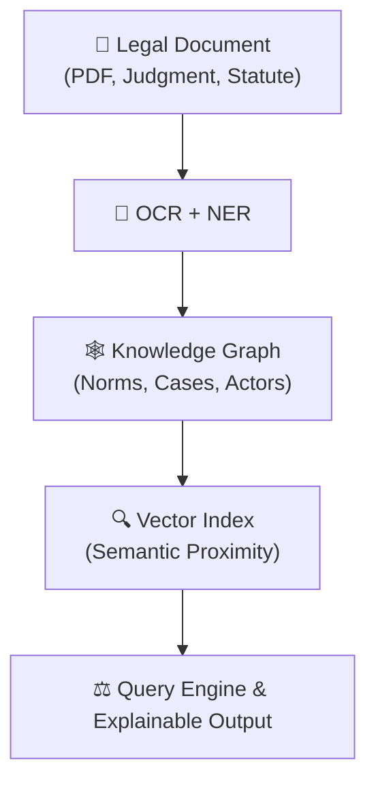

import { Code } from 'astro-expressive-code/components';

import OptImg from '../../components/OptImg.astro'

Before large language models, legal search was already fundamentally broken. For decades, the law — a network of principles — has been flattened into a simple corpus of texts, where relevance is dictated by occurrence and frequency, not by coherence and meaning. This regression, which masquerades as progress, has created a standard of “fluency without fidelity” across LegalTech.

The answer is not a faster search engine, but a completely different architecture. This analysis details the required pivot: moving from statistical ranking to a Hybrid Pipeline powered by Knowledge Graphs and a strict mandate for Explainability by Design. When the reasoning is clear, speed is irrelevant; clarity itself becomes efficiency.

## 1. From Retrieval to Reasoning

Before artificial intelligence entered the conversation, the foundations of legal search were already flawed. The problem did not begin with ChatGPT or semantic embeddings — it began decades earlier, when law libraries were digitized under a logic of retrieval rather than reasoning.

A jurist reads to understand _relationships_; a search engine retrieves _occurrences_. That difference may sound technical, but it defines the epistemology of justice in the digital age.

In classical reasoning, a jurist does not ask, _“Where does this word appear?”_ but rather, _“What principle connects this case, this statute, and this decision?”_ Law is a network of meanings, not a corpus of texts. Every article, every precedent, is a node in a web of interpretation. To find truth, one must traverse the links, not the surface.

Yet our digital systems flatten this structure. They rank by frequency, not by force. The most repeated notion often eclipses the most relevant one, and the most cited case replaces the most foundational. Search engines operate on the probability of co-occurrence, while law operates on the coherence of principles.

The result is a quiet epistemic fracture. Lawyers still speak in logic; machines answer in statistics. And between these two languages, the reasoning disappears.

The deeper irony is that this regression masquerades as progress. We built elaborate ranking models, refined TF-IDF scores, and later, vector embeddings, claiming to make legal research “smarter.” In truth, we only made it faster — and in doing so, we lost sight of the slow, deliberative reasoning that gives justice its legitimacy.

The law, unlike most domains, cannot be reduced to relevance. A relevant case may still be wrong; a rare case may reveal the core principle. Justice is not optimized for recall; it is calibrated for meaning.

The task ahead, then, is not to add more intelligence to search, but to restore the grammar of reasoning it once erased. To make the digital index think again in terms of causes, consequences, and contradictions. To move from retrieval to reasoning — because in the end, a fair system must not only find the law; it must understand why it matters.

## 2. Why Keyword Search Broke the Law

The first generation of digital legal tools inherited a librarian’s mindset: findable, sortable, retrievable. It worked — until the quantity of data exploded and the nature of law itself changed. When courts began publishing thousands of decisions monthly and statutes evolved in near-real time, the simple act of _finding_ ceased to be the challenge. The challenge became _understanding_.

Keyword search, however, never evolved. It continued to assume that proximity of words equaled proximity of meaning. In legal reasoning, this assumption is catastrophic.

Consider the expression _“best interest of the child.”_ In one judgment, it defines protection; in another, it justifies removal. The same phrase may express compassion or coercion, depending on who invokes it and why. Yet to a keyword search engine, these contexts are identical — interchangeable entries on a list.

This flattening of meaning does not merely mislead; it rewires how practitioners think. Once search results become ranked truths, the reasoning behind them fades. What was once an act of interpretation becomes an act of selection.

The law’s authority depends on traceable justification. Keyword search breaks that chain. It produces results without reason, relevance without rationale. The most cited case becomes the most seen, the most seen becomes the most used, and circular validation replaces critical reading.

> _When algorithms reward repetition, doctrine becomes echo._

This quiet erosion has measurable effects. Students cite by ranking. Judges, overwhelmed by volume, rely on the first ten results. Lawyers equate precision with convenience. The machine’s metric becomes the measure of truth.

The tragedy is not technological — it’s philosophical. Keyword search redefined law as data and reasoning as metadata. It didn’t just digitize jurisprudence; it derealized it.

Reclaiming that lost dimension means rebuilding search engines around structure, not syntax. It requires a return to the architecture of reasoning: identifying propositions, linking principles, weighting contradictions. The future of legal AI will not depend on faster indexes but on slower, more deliberate models of understanding — ones that can distinguish frequency from validity, and recall from reasoning.

## 3. The Illusion of Smart Legal AI

If keyword search reduced law to syntax, the current wave of artificial intelligence risks reducing it to style. The new systems no longer retrieve information; they _generate_ it. And in that shift from retrieval to generation lies a quiet epistemic danger: fluency without fidelity.

Large Language Models do not understand the law. They predict the next word based on patterns of probability. Their authority is linguistic, not logical. They imitate reasoning without performing it. The result is a perfect illusion of thought — persuasive, articulate, and wrong.

In technical terms, these systems operate on correlation, not causation. They detect that certain words often appear together — “court”, “held”, “therefore” — and infer a plausible continuation. But legal reasoning is built on _why_ these words appear together, not _how often_. The model knows the rhythm of the law, not its reason.

That difference matters. When a system cannot distinguish between a binding precedent and an opinion blog, it may cite both with equal confidence. When it cannot recognize the hierarchy of norms, it may generate arguments that are logically coherent yet legally void.

This is not intelligence; it is mimicry. A linguistic deepfake of legal reasoning.

> _The danger of AI in law is not that it will think for us, but that it will convince us it already does._

The seduction of such systems lies in their fluency. They give back to the user what the keyword engine never could: an illusion of dialogue, of understanding. But dialogue built on probability is a dangerous comfort. It erodes the distinction between _speaking about_ the law and _reasoning within_ it.

Worse, these systems blur accountability. A wrong citation from a database is a traceable error; a wrong inference from a generative model is an invisible one. When responsibility dissolves into a statistical fog, justice risks becoming a function of persuasion rather than proof.

What legal AI needs, therefore, is not more intelligence but more integrity — mechanisms to trace, justify, and explain every inference it makes. Because in law, transparency is not a feature; it is the foundation of legitimacy.

To claim intelligence without it is to automate the appearance of justice, not its substance.

## 4. Rebuilding Meaning: The Hybrid Pipeline

If keyword search flattened the law and generative AI blurred it, the way forward is not rejection but reconstruction. Law must be restructured digitally in a way that mirrors how jurists think: through logic, relations, and meaning.

This reconstruction requires a hybrid architecture — one that combines the precision of symbolic reasoning with the flexibility of semantic intelligence. In other words, the law must once again become a graph of sense, not a list of strings.

At the core of this approach lies the _hybrid pipeline_:

1.  OCR + NER: converts unstructured documents into structured data, extracting named entities such as articles, judges, courts, and litigants.
2.  Knowledge Graph: maps explicit relationships — citations, references, hierarchies — that give the legal text its internal logic.
3.  Vector Index: adds a semantic layer, capturing conceptual similarity where literal links do not exist.
4.  Query Engine: merges both symbolic and semantic signals to produce traceable, ranked results.

Each stage adds depth, but more importantly, it adds accountability. Every inference can be retraced through its lineage: the source document, the identified entities, the graph connections, and the vector embeddings that refined relevance.

This architecture creates a dialogue between structure and meaning. The graph ensures rigor; the vector layer adds nuance. Together, they build systems that do not merely retrieve but reason — capable of showing _why_ a case is connected to another, not just _that_ it is.

Such a system is not hypothetical. The technologies exist: OCRmyPDF, spaCy, Neo4j, Weaviate, PostgreSQL, and Explainable AI frameworks can already form this backbone. What is missing is not capability, but philosophical intent — a commitment to design for understanding, not just efficiency.

> _The future of legal AI will not be won by the fastest model, but by the one that can justify every link it draws._

Rebuilding meaning, then, is not a technical problem but an ethical one. It means deciding that clarity matters more than convenience, and that explainability is not an option — it is the digital form of due process.

## 5. Explainability by Design

In law, explanation is not decoration — it is duty. A judgment without reasoning is void; a search result without justification is meaningless. Yet in the rush to automate, we built systems that answer faster than they think, and speak louder than they know.

Explainability by design begins where automation ends: with accountability.

There are four dimensions to this accountability, each reflecting a principle as old as jurisprudence itself:

1.  Source Traceability — The Origin of Proof. Every result must be anchored in a verifiable source. A citation, a paragraph, a statute — something that can be read, challenged, and confirmed. The digital chain of custody is not a luxury; it is the backbone of trust.
2.  Structural Transparency — The Architecture of Logic. The reasoning path must remain visible. From OCR to NER, from embedding to retrieval, each layer must leave an audit trail. Without visibility, every correct answer is accidental.
3.  Decision Accountability — The Logic of Choice. When two cases appear equally relevant, the system must reveal _why_ one was preferred. Legal search is not a lottery; ranking is reasoning. If the model cannot explain its hierarchy, it should not impose one.
4.  Epistemic Humility — The Boundary of Knowledge. No system should pretend omniscience. Law evolves, interpretation diverges, and data is incomplete. A just model admits uncertainty. In doing so, it mirrors the honesty of a good judge: confident in principle, cautious in verdict.

> _Explainability is not a feature; it is the constitutional form of AI integrity._

True LegalTech will not be defined by who automates the most, but by who explains the best. The credibility of future legal systems will rest not on how fast they deliver answers, but on how transparently they justify them.

Designing for explainability, then, is designing for justice. It restores the link between logic and legitimacy — and reminds us that in law, the only acceptable black box is a robe.

## 6. Toward a Juridical Intelligence

The future of law will not be decided by algorithms, but by the intentions that shape them. Technology, left to its own inertia, tends toward efficiency; justice, toward meaning. Reconciling the two is not a technical challenge — it is a civic one.

Legal AI must therefore evolve beyond the promise of “smart search” or “predictive justice.” Its purpose is not to predict outcomes, but to preserve understanding. The task is not to accelerate decision-making, but to illuminate its logic. Because when the reasoning is clear, speed becomes irrelevant; clarity itself becomes efficiency.

A _juridical intelligence_ begins at that intersection — where computation serves interpretation, and every line of code remains accountable to the principle it models. It does not seek to replace the jurist, but to amplify their capacity to see patterns of meaning across the ocean of text. Its power lies not in autonomy, but in alignment: the alignment between human reason and machine representation.

This vision redefines progress. Not more automation, but better articulation. Not artificial intelligence, but amplified deliberation.

The law is not a relic to be optimized; it is a living architecture of reasoning. To encode it well is to respect its complexity. To automate it blindly is to dissolve it.

The systems we build today will become the infrastructure of justice tomorrow. The question, then, is not whether AI will transform the law — it already has. The question is whether we will let it flatten meaning or help it think again.

And if we succeed, it will not be because machines became more human, but because we remembered what it means to be reasonable.