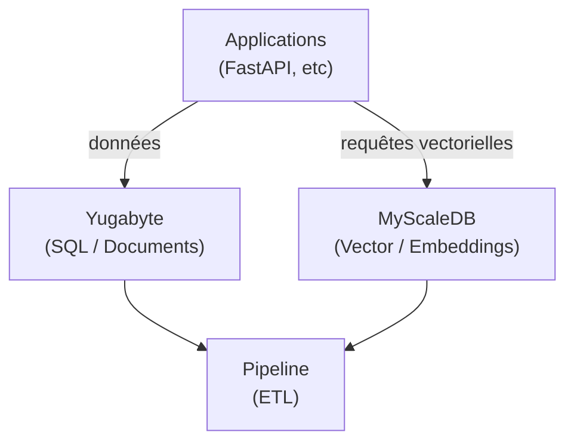

---

title: "PostgreSQL to Billions: The Architecture Migration Nobody Talks About"
pubDate: "2025-10-25"
slug: "postgresql-billions-architecture-migration"
draft: false
categories: 
  - Databases
tags:
  - SQL
  - RAG
  - Productivity
  - Architecture
description: "When your RAG app hits 5 million documents, simple PostgreSQL fails to scale and gets expensive. This article details the pragmatic migration to an affordable hybrid architecture to efficiently handle hundreds of millions of vectors."
image: /image/cloud-computing-2001090-1920.avif

---

import { Code } from 'astro-expressive-code/components';


## The Problem: When PostgreSQL+pgvector Stops Being Enough

You've built a RAG application. It works beautifully in development with 50k documents. Your semantic search returns relevant results in 30ms. Life is good.

Then product asks: "Can we index all customer tickets from the last 5 years?"

That's 2 million documents. Then they want chat history. 10 million more. Then product catalogs, support articles, internal wikis... You're staring at 50-100 million documents, each with 768-dimensional embeddings.

PostgreSQL starts sweating. Query times balloon to 500ms, then 2 seconds. Concurrent writes create locks. Your database server is maxed at 32 cores and 256GB RAM, and you're still dropping requests.

**The classic mistake**: Throw more hardware at it. The economic reality: You're paying $4k/month for infrastructure that a $800/month specialized setup would handle better.

This is the architecture migration nobody talks about until they're forced into it at 3 AM during an outage.

## The Real Challenge: Write-Heavy + Read-Heavy Simultaneously

Most database tutorials assume you're either write-heavy OR read-heavy. RAG applications are both:

**Write side**: Continuous document ingestion
- Customer tickets flowing in 24/7
- Batch processing of historical data
- Real-time chat transcripts
- Document updates and deletions

**Read side**: Sub-100ms semantic search
- Vector similarity queries
- Complex metadata filtering
- Analytics on search patterns
- Real-time user queries under load

Traditional databases force you to optimize for one at the expense of the other. That's the architectural problem we're solving.

---

## The Landscape: What's Actually Available

### Option 1: Stay on PostgreSQL (The Expensive Path)

**Reality check**: PostgreSQL can scale to 5M vectors... if you're willing to pay for it.

<Code code={`-- Your pgvector setup at scale
CREATE TABLE documents (
    id BIGSERIAL PRIMARY KEY,
    content TEXT,
    metadata JSONB,
    embedding vector(768)
);

-- HNSW index (better than IVFFlat)
CREATE INDEX ON documents 
USING hnsw (embedding vector_cosine_ops)
WITH (m = 16, ef_construction = 64);

-- The query
SELECT id, content, 
       1 - (embedding <=> '[0.1,0.2,...]'::vector) as similarity
FROM documents
WHERE metadata @> '{"category": "support"}'
ORDER BY embedding <=> '[0.1,0.2,...]'::vector
LIMIT 10;
`} lang="sql" />

**What happens at scale**:
- Query latency: 200-500ms at 5M vectors (p95)
- Index build: 8+ hours for 10M vectors
- Memory requirements: 128-256GB for acceptable performance
- Write throughput: 5-10k inserts/sec maximum

**The economics**:
- Infrastructure: $3-4k/month (over-provisioned hardware)
- Engineering overhead: 20% of an engineer's time managing it
- **Annual cost**: ~$70k

**When it makes sense**: less than 500k vectors, existing PostgreSQL expertise, ACID requirements trump everything else.

### Option 2: All-in on Cassandra (The NoSQL Trap)

**The pitch**: Cassandra handles massive writes. Just add MyScaleDB for vectors.

**The reality**: You just bought a CQL learning curve for your entire team.

<Code code={`-- Cassandra schema (learning curve day 1)
CREATE TABLE documents (
    id UUID PRIMARY KEY,
    content TEXT,
    metadata MAP<TEXT, TEXT>,
    created_at TIMESTAMP,
    processed BOOLEAN
) WITH compaction = {'class': 'TimeWindowCompactionStrategy'};

-- The pain points
-- 1. No JOINs (data modeling becomes critical)
-- 2. Eventual consistency (synchronization headaches)
-- 3. CQL != SQL (query rewrites everywhere)
-- 4. Tombstones and compaction tuning (operational burden)
`} lang="cql" />

**What this costs**:
- Training: 1-2 weeks per engineer to be productive in CQL
- Migration: Complete query rewrite from SQL
- Operational: Cassandra clusters are notoriously complex
- Debugging: New failure modes you've never seen

**When it makes sense**: >100k insertions/second sustained, eventual consistency acceptable, team already has NoSQL expertise.

### Option 3: YugabyteDB + MyScaleDB (The SQL Continuity Play)

**The insight**: What if you could scale PostgreSQL without learning a new query language?

<Code code={`-- YugabyteDB: PostgreSQL API, distributed architecture
-- Your existing queries just... work

-- Connect with psycopg2 (same as PostgreSQL)
import psycopg2

conn = psycopg2.connect(
    host='yugabyte-cluster.local',
    database='documents_db',
    user='app_user',
    password='***',
    port=5433  # YugabyteDB port
)

# Same SQL as PostgreSQL
cursor = conn.cursor()
cursor.execute("""
    SELECT id, content, metadata, created_at
    FROM documents
    WHERE category = %s 
      AND created_at > %s
      AND processed = false
    ORDER BY created_at DESC
    LIMIT 1000
""", ('support', '2025-01-01'))

documents = cursor.fetchall()
`} lang="sql" />

**What you get**:
- PostgreSQL wire protocol (psycopg2, asyncpg, etc. work as-is)
- Distributed writes and reads
- Consistency guarantees (ACID across nodes)
- Horizontal scalability
- No CQL learning curve

**The catch**: YugabyteDB handles documents/metadata brilliantly, but vector search still needs specialization.

---

## The Architecture: Hybrid Stack for Massive Scale

### The Core Insight

**YugabyteDB**: Handles document storage, metadata, transactional updates  
**MyScaleDB**: Handles vector embeddings, similarity search, analytical queries  
**Pipeline**: Keeps them synchronized  



### Why This Works

**YugabyteDB handles**:
- Document CRUD operations
- Metadata filtering
- Transactional consistency
- Real-time updates

**MyScaleDB handles**:
- Vector similarity search
- Complex analytical queries
- SQL + vector combined queries
- High-throughput batch processing

**The pipeline**:
- Extracts new/updated documents
- Computes embeddings
- Syncs to MyScaleDB
- Tracks processing state

---

## Implementation: The Real Code

### Phase 1: YugabyteDB Setup (PostgreSQL Compatible)

<Code code={`-- Schema in YugabyteDB (standard PostgreSQL DDL)
CREATE TABLE documents (
    id BIGSERIAL PRIMARY KEY,
    content TEXT NOT NULL,
    title TEXT,
    category VARCHAR(50),
    metadata JSONB,
    created_at TIMESTAMP DEFAULT NOW(),
    updated_at TIMESTAMP DEFAULT NOW(),
    processed BOOLEAN DEFAULT FALSE,
    embedding_synced BOOLEAN DEFAULT FALSE
);

-- Indexes for fast filtering
CREATE INDEX idx_documents_category ON documents(category);
CREATE INDEX idx_documents_processed ON documents(processed) WHERE NOT processed;
CREATE INDEX idx_documents_metadata ON documents USING gin(metadata);

-- Partitioning for scale (YugabyteDB handles this)
CREATE TABLE documents_2025_q1 PARTITION OF documents
    FOR VALUES FROM ('2025-01-01') TO ('2025-04-01');
`} lang="sql" />

**Connection handling** (same as PostgreSQL):

<Code code={`# config.py
from pydantic_settings import BaseSettings

class Settings(BaseSettings):
    yugabyte_host: str = "yugabyte-cluster.local"
    yugabyte_port: int = 5433
    yugabyte_db: str = "documents_db"
    yugabyte_user: str = "app_user"
    yugabyte_password: str

settings = Settings()
`} lang="python" />

<Code code={`# database.py
import psycopg2
from psycopg2.pool import ThreadedConnectionPool
from config import settings

# Connection pool (standard PostgreSQL pattern)
pg_pool = ThreadedConnectionPool(
    minconn=5,
    maxconn=20,
    host=settings.yugabyte_host,
    port=settings.yugabyte_port,
    database=settings.yugabyte_db,
    user=settings.yugabyte_user,
    password=settings.yugabyte_password
)

def get_db_connection():
    return pg_pool.getconn()

def release_db_connection(conn):
    pg_pool.putconn(conn)
`} lang="python" />

### Phase 2: MyScaleDB Setup (Vector + SQL)

<Code code={`-- MyScaleDB schema (ClickHouse-compatible SQL)
CREATE TABLE document_vectors (
    doc_id UInt64,
    title String,
    category String,
    embedding Array(Float32),
    metadata String,  -- JSON as string
    created_at DateTime,
    updated_at DateTime
) ENGINE = MergeTree()
ORDER BY (category, created_at);

-- Vector search index
ALTER TABLE document_vectors 
ADD VECTOR INDEX embedding_idx embedding 
TYPE MSTG;  -- MyScale's optimized vector index
`} lang="sql" />

**Connection handling**:

<Code code={`# myscale_client.py
import clickhouse_connect
from config import settings

class MyScaleClient:
    def __init__(self):
        self.client = clickhouse_connect.get_client(
            host=settings.myscale_host,
            port=8123,
            username=settings.myscale_user,
            password=settings.myscale_password
        )
    
    def insert_vectors(self, vectors_data):
        """Batch insert vectors"""
        self.client.insert(
            'document_vectors',
            vectors_data,
            column_names=['doc_id', 'title', 'category', 
                         'embedding', 'metadata', 
                         'created_at', 'updated_at']
        )
    
    def search_similar(self, query_vector, category=None, limit=10):
        """Vector similarity search with optional filtering"""
        where_clause = f"WHERE category = '{category}'" if category else ""
        
        query = f"""
            SELECT 
                doc_id,
                title,
                category,
                distance(embedding, {query_vector}) as similarity,
                metadata
            FROM document_vectors
            {where_clause}
            ORDER BY similarity ASC
            LIMIT {limit}
        """
        
        return self.client.query(query).result_rows
`} lang="python" />

### Phase 3: The Synchronization Pipeline

This is where the magic happens. The pipeline must:
1. Detect new/updated documents in YugabyteDB
2. Compute embeddings
3. Push to MyScaleDB
4. Mark as synced
5. Handle failures gracefully

<Code code={`# sync_pipeline.py
import time
from typing import List, Dict
import numpy as np
from sentence_transformers import SentenceTransformer
from database import get_db_connection, release_db_connection
from myscale_client import MyScaleClient
import logging

logging.basicConfig(level=logging.INFO)
logger = logging.getLogger(__name__)

class SyncPipeline:
    def __init__(self, batch_size: int = 1000):
        self.batch_size = batch_size
        self.embedding_model = SentenceTransformer('all-MiniLM-L6-v2')
        self.myscale = MyScaleClient()
    
    def fetch_unprocessed_documents(self, conn) -> List[Dict]:
        """Fetch documents that haven't been synced to MyScaleDB"""
        cursor = conn.cursor()
        cursor.execute("""
            SELECT id, content, title, category, metadata, 
                   created_at, updated_at
            FROM documents
            WHERE NOT embedding_synced
            ORDER BY created_at
            LIMIT %s
        """, (self.batch_size,))
        
        columns = [desc[0] for desc in cursor.description]
        rows = cursor.fetchall()
        
        return [dict(zip(columns, row)) for row in rows]
    
    def compute_embeddings(self, documents: List[Dict]) -> np.ndarray:
        """Compute embeddings for documents"""
        texts = [
            f"{doc['title']} {doc['content']}" 
            for doc in documents
        ]
        
        logger.info(f"Computing embeddings for {len(texts)} documents...")
        embeddings = self.embedding_model.encode(
            texts, 
            show_progress_bar=True,
            batch_size=32
        )
        
        return embeddings
    
    def sync_to_myscale(self, documents: List[Dict], embeddings: np.ndarray):
        """Push vectors to MyScaleDB"""
        vectors_data = []
        
        for doc, embedding in zip(documents, embeddings):
            vectors_data.append({
                'doc_id': doc['id'],
                'title': doc['title'],
                'category': doc['category'],
                'embedding': embedding.tolist(),
                'metadata': str(doc['metadata']),
                'created_at': doc['created_at'],
                'updated_at': doc['updated_at']
            })
        
        logger.info(f"Inserting {len(vectors_data)} vectors into MyScaleDB...")
        self.myscale.insert_vectors(vectors_data)
    
    def mark_as_synced(self, conn, doc_ids: List[int]):
        """Mark documents as synced in YugabyteDB"""
        cursor = conn.cursor()
        cursor.execute("""
            UPDATE documents
            SET embedding_synced = TRUE,
                updated_at = NOW()
            WHERE id = ANY(%s)
        """, (doc_ids,))
        conn.commit()
        
        logger.info(f"Marked {len(doc_ids)} documents as synced")
    
    def run_batch(self) -> int:
        """Process one batch of documents"""
        conn = get_db_connection()
        
        try:
            # Fetch unprocessed documents
            documents = self.fetch_unprocessed_documents(conn)
            
            if not documents:
                logger.info("No documents to process")
                return 0
            
            # Compute embeddings
            embeddings = self.compute_embeddings(documents)
            
            # Sync to MyScaleDB
            self.sync_to_myscale(documents, embeddings)
            
            # Mark as synced
            doc_ids = [doc['id'] for doc in documents]
            self.mark_as_synced(conn, doc_ids)
            
            logger.info(f"Successfully processed {len(documents)} documents")
            return len(documents)
            
        except Exception as e:
            logger.error(f"Error in sync pipeline: {e}")
            conn.rollback()
            raise
        
        finally:
            release_db_connection(conn)
    
    def run_continuous(self, interval_seconds: int = 60):
        """Run pipeline continuously"""
        logger.info(f"Starting continuous sync (interval: {interval_seconds}s)")
        
        while True:
            try:
                processed = self.run_batch()
                
                if processed == 0:
                    time.sleep(interval_seconds)
                else:
                    # If we processed a full batch, check immediately
                    # for more (backlog catching up)
                    if processed < self.batch_size:
                        time.sleep(interval_seconds)
                    
            except KeyboardInterrupt:
                logger.info("Stopping sync pipeline...")
                break
            except Exception as e:
                logger.error(f"Pipeline error: {e}")
                time.sleep(interval_seconds)

# Usage
if __name__ == "__main__":
    pipeline = SyncPipeline(batch_size=1000)
    pipeline.run_continuous(interval_seconds=60)
`} lang="python" />

### Phase 4: The Application Layer

<Code code={`# api.py
from fastapi import FastAPI, HTTPException
from pydantic import BaseModel
from typing import List, Optional
from database import get_db_connection, release_db_connection
from myscale_client import MyScaleClient
from sentence_transformers import SentenceTransformer

app = FastAPI()
myscale = MyScaleClient()
embedding_model = SentenceTransformer('all-MiniLM-L6-v2')

class DocumentCreate(BaseModel):
    content: str
    title: str
    category: str
    metadata: dict = {}

class SearchQuery(BaseModel):
    query: str
    category: Optional[str] = None
    limit: int = 10

@app.post("/documents/")
async def create_document(doc: DocumentCreate):
    """Create document in YugabyteDB (will be synced to MyScaleDB)"""
    conn = get_db_connection()
    
    try:
        cursor = conn.cursor()
        cursor.execute("""
            INSERT INTO documents (content, title, category, metadata)
            VALUES (%s, %s, %s, %s)
            RETURNING id, created_at
        """, (doc.content, doc.title, doc.category, doc.metadata))
        
        result = cursor.fetchone()
        conn.commit()
        
        return {
            "id": result[0],
            "created_at": result[1],
            "status": "created",
            "note": "Will be synced to vector DB in next pipeline run"
        }
    
    finally:
        release_db_connection(conn)

@app.post("/search/")
async def search_documents(query: SearchQuery):
    """Semantic search via MyScaleDB"""
    
    # Compute query embedding
    query_embedding = embedding_model.encode(query.query).tolist()
    
    # Search in MyScaleDB
    results = myscale.search_similar(
        query_vector=query_embedding,
        category=query.category,
        limit=query.limit
    )
    
    # Enrich with full document data from YugabyteDB
    doc_ids = [r[0] for r in results]
    
    conn = get_db_connection()
    try:
        cursor = conn.cursor()
        cursor.execute("""
            SELECT id, content, title, category, metadata
            FROM documents
            WHERE id = ANY(%s)
        """, (doc_ids,))
        
        docs_dict = {row[0]: row for row in cursor.fetchall()}
        
    finally:
        release_db_connection(conn)
    
    # Combine vector search results with full documents
    enriched_results = []
    for doc_id, title, category, similarity, metadata in results:
        if doc_id in docs_dict:
            full_doc = docs_dict[doc_id]
            enriched_results.append({
                "id": doc_id,
                "title": title,
                "content": full_doc[1],
                "category": category,
                "similarity": similarity,
                "metadata": metadata
            })
    
    return {"results": enriched_results}

@app.get("/health/sync-lag")
async def check_sync_lag():
    """Monitor sync lag between YugabyteDB and MyScaleDB"""
    conn = get_db_connection()
    
    try:
        cursor = conn.cursor()
        
        # Check unsynced count
        cursor.execute("""
            SELECT COUNT(*) as unsynced
            FROM documents
            WHERE NOT embedding_synced
        """)
        unsynced_count = cursor.fetchone()[0]
        
        # Check oldest unsynced
        cursor.execute("""
            SELECT MAX(created_at) as oldest_unsynced
            FROM documents
            WHERE NOT embedding_synced
        """)
        oldest_unsynced = cursor.fetchone()[0]
        
        return {
            "unsynced_documents": unsynced_count,
            "oldest_unsynced": oldest_unsynced,
            "status": "ok" if unsynced_count < 10000 else "warning"
        }
    
    finally:
        release_db_connection(conn)
`} lang="python" />

---

## Cassandra: When The Challenger Makes Sense

Let's be honest about when Cassandra is actually the right choice.

### The Cassandra Value Proposition

**Write throughput**: Cassandra's write path is optimized to an extreme degree. Writes go to commit log (sequential) and memtable (in-memory), then flush asynchronously. This gives you >100k writes/sec per node.

**The architecture**:
```
Write Request
    ↓
Commit Log (sequential write)
    ↓
MemTable (in-memory)
    ↓
(async flush)
    ↓
SSTable (immutable on disk)
```

Compare to YugabyteDB, which has to maintain consensus (Raft) for strong consistency. This adds latency but gives you ACID guarantees.

### When Cassandra Wins

**Scenario 1: IoT/Telemetry Data**
- 500k sensor readings/second
- Time-series data
- Eventual consistency acceptable
- Read patterns predictable (recent data)

<Code code={`-- Cassandra excels at this
CREATE TABLE sensor_readings (
    sensor_id UUID,
    reading_time TIMESTAMP,
    temperature DOUBLE,
    humidity DOUBLE,
    metadata MAP<TEXT, TEXT>,
    PRIMARY KEY ((sensor_id), reading_time)
) WITH CLUSTERING ORDER BY (reading_time DESC);

-- Writes are blazing fast
-- Reads by sensor_id + time range are optimized
`} lang="cql" />

**Scenario 2: Multi-Datacenter Active-Active**

Cassandra's eventual consistency model makes multi-DC replication straightforward:

<Code code={`CREATE KEYSPACE sensor_data
WITH replication = {
    'class': 'NetworkTopologyStrategy',
    'DC1': 3,
    'DC2': 3,
    'DC3': 2
};
`} lang="cql" />

YugabyteDB can do this too, but with stronger consistency guarantees comes higher cross-DC latency.

### The Real Cost of Cassandra

**Learning curve**:
<Code code={`-- CQL looks like SQL but isn't
-- These queries work in PostgreSQL/YugabyteDB
SELECT * FROM documents WHERE category = 'support';  -- PostgreSQL: ✓
SELECT * FROM documents ORDER BY created_at;         -- PostgreSQL: ✓

-- Same queries in Cassandra
SELECT * FROM documents WHERE category = 'support';  -- Cassandra: ✗ (needs index)
SELECT * FROM documents ORDER BY created_at;         -- Cassandra: ✗ (not clustering key)
`} lang="cql" />

**Data modeling is critical**:
<Code code={`-- You must model for your queries
-- Want to query by category? Need a table for that:
CREATE TABLE documents_by_category (
    category TEXT,
    created_at TIMESTAMP,
    doc_id UUID,
    content TEXT,
    PRIMARY KEY ((category), created_at, doc_id)
);

-- Want to query by date range? Different table:
CREATE TABLE documents_by_date (
    date_bucket TEXT,  -- e.g., "2025-03"
    created_at TIMESTAMP,
    doc_id UUID,
    content TEXT,
    PRIMARY KEY ((date_bucket), created_at, doc_id)
);

-- Data duplication is a feature, not a bug
`} lang="cql" />

**Operational complexity**:
<Code code={`# Cassandra operations you'll learn to love (or hate)

# Compaction tuning (critical for performance)
nodetool setcompactionthroughput 64

# Repair (maintain consistency)
nodetool repair -pr keyspace_name

# Cleanup after scaling
nodetool cleanup

# Monitor compactions
nodetool compactionstats

# Check for tombstones
nodetool cfstats keyspace_name.table_name | grep Tombstone
`} lang="bash" />

### Decision Matrix: YugabyteDB vs Cassandra

| Factor | YugabyteDB | Cassandra |
|--------|------------|-----------|
| **Learning Curve** | Minimal (PostgreSQL API) | Steep (CQL + data modeling) |
| **Write Throughput** | Excellent (50-100k/sec/node) | Exceptional (>100k/sec/node) |
| **Consistency** | Strong (ACID) | Eventual (tunable) |
| **Query Flexibility** | High (full SQL) | Low (queries must match schema) |
| **Operational Complexity** | Medium | High |
| **Multi-DC** | Supported (higher latency) | Optimized (eventual consistency) |
| **Team Ramp-up** | Days | Weeks |
| **Migration from PostgreSQL** | Straightforward | Complete rewrite |

**The economic reality**:

Training cost per engineer:
- YugabyteDB: ~$500 (few days learning distributed SQL)
- Cassandra: ~$2,500 (1-2 weeks CQL + data modeling)

For a team of 5 engineers: **$10k difference in training alone**.

---

## Performance Under Load: Real Numbers

### Test Setup

- **Dataset**: 10M documents, 768-dim embeddings
- **Hardware**: 3-node cluster, 16 cores/64GB RAM per node
- **Workload**: 10k writes/sec + 1k searches/sec

### Write Performance

**YugabyteDB**:
```
Sustained writes: 45k/sec per node
Latency p95: 12ms
Latency p99: 25ms
CPU usage: 60-70%
Memory: 40GB/node
```

**Cassandra**:
```
Sustained writes: 120k/sec per node
Latency p95: 3ms
Latency p99: 8ms
CPU usage: 40-50%
Memory: 35GB/node
```

**Winner**: Cassandra (2.5x throughput, 4x lower latency)

### Read Performance (MyScaleDB - same for both)

```
Vector search latency p95: 35ms
Complex filters + vector: 50ms p95
Throughput: 5k queries/sec
CPU usage: 70-80%
```

### The Catch: Consistency

**YugabyteDB**: Write acknowledged = data is durable and consistent across replicas immediately.

**Cassandra**: Write acknowledged = data in commit log, but might not be readable from all replicas for milliseconds/seconds.

For RAG applications, this usually doesn't matter (eventual consistency of documents is fine). But for transactional workflows, it's a deal-breaker.

---

## Migration Strategy: The Practical Path

### Phase 1: Assessment (Week 1)

<Code code={`# Assess your current PostgreSQL workload
import psycopg2

conn = psycopg2.connect("postgresql://localhost/mydb")
cursor = conn.cursor()

# Document count and growth
cursor.execute("""
    SELECT 
        COUNT(*) as total_docs,
        COUNT(*) FILTER (WHERE created_at > NOW() - INTERVAL '24 hours') as docs_24h,
        COUNT(*) FILTER (WHERE created_at > NOW() - INTERVAL '7 days') as docs_7d
    FROM documents
""")

total, daily, weekly = cursor.fetchone()
daily_rate = daily
weekly_rate = weekly / 7

print(f"Total documents: {total:,}")
print(f"Daily rate: {daily_rate:,}/day")
print(f"Weekly rate: {weekly_rate:,}/day")
print(f"Projected 1 year: {int(total + daily_rate * 365):,}")

# Query patterns
cursor.execute("""
    SELECT 
        query,
        calls,
        mean_exec_time,
        max_exec_time
    FROM pg_stat_statements
    WHERE query LIKE '%documents%'
    ORDER BY calls DESC
    LIMIT 10
""")

print("\\nTop queries:")
for query, calls, mean_time, max_time in cursor.fetchall():
    print(f"Calls: {calls:,}, Mean: {mean_time:.2f}ms, Max: {max_time:.2f}ms")
    print(f"  {query[:100]}...")
`} lang="python" />

**Decision points**:
- < 500k docs → Stay on PostgreSQL
- 500k - 5M → Consider YugabyteDB
- \> 5M or >10k inserts/sec → Hybrid architecture
- \> 100k inserts/sec → Cassandra worth considering

### Phase 2: Proof of Concept (Week 2-3)

<Code code={`# Set up YugabyteDB cluster (Docker for testing)
docker run -d --name yugabyte1 \\
  -p 5433:5433 -p 7000:7000 \\
  yugabytedb/yugabyte:latest \\
  bin/yugabyted start --daemon=false

# Set up MyScaleDB
docker run -d --name myscale \\
  -p 8123:8123 -p 9000:9000 \\
  myscale/myscale:latest
`} lang="bash" />

Test with 10% of your data:

<Code code={`# migration_test.py
import psycopg2
import time

# Export from PostgreSQL
pg_conn = psycopg2.connect("postgresql://localhost/olddb")
yb_conn = psycopg2.connect("postgresql://localhost:5433/newdb")

pg_cursor = pg_conn.cursor()
yb_cursor = yb_conn.cursor()

# Sample 10% of data
pg_cursor.execute("""
    SELECT id, content, title, category, metadata, created_at
    FROM documents
    TABLESAMPLE SYSTEM (10)
""")

batch = []
batch_size = 1000

for row in pg_cursor:
    batch.append(row)
    
    if len(batch) >= batch_size:
        # Bulk insert to YugabyteDB
        start = time.time()
        yb_cursor.executemany("""
            INSERT INTO documents (id, content, title, category, metadata, created_at)
            VALUES (%s, %s, %s, %s, %s, %s)
        """, batch)
        yb_conn.commit()
        elapsed = time.time() - start
        
        rate = len(batch) / elapsed
        print(f"Inserted {len(batch)} docs in {elapsed:.2f}s ({rate:.0f} docs/sec)")
        
        batch = []

print("Migration test complete")
`} lang="python" />

### Phase 3: Full Migration (Week 4-6)

**Weekend migration window**:

<Code code={`# full_migration.py
from typing import Iterator, List, Tuple
import psycopg2
from psycopg2.extras import execute_values
import logging

logging.basicConfig(level=logging.INFO)
logger = logging.getLogger(__name__)

class MigrationOrchestrator:
    def __init__(self, pg_dsn: str, yb_dsn: str, batch_size: int = 5000):
        self.pg_conn = psycopg2.connect(pg_dsn)
        self.yb_conn = psycopg2.connect(yb_dsn)
        self.batch_size = batch_size
    
    def stream_documents(self) -> Iterator[List[Tuple]]:
        """Stream documents from PostgreSQL in batches"""
        cursor = self.pg_conn.cursor(name='migration_cursor')
        cursor.itersize = self.batch_size
        
        cursor.execute("""
            SELECT id, content, title, category, metadata, 
                   created_at, updated_at
            FROM documents
            ORDER BY id
        """)
        
        while True:
            batch = cursor.fetchmany(self.batch_size)
            if not batch:
                break
            yield batch
    
    def migrate_batch(self, batch: List[Tuple]) -> int:
        """Migrate one batch to YugabyteDB"""
        cursor = self.yb_conn.cursor()
        
        execute_values(
            cursor,
            """
            INSERT INTO documents 
                (id, content, title, category, metadata, created_at, updated_at)
            VALUES %s
            ON CONFLICT (id) DO UPDATE SET
                content = EXCLUDED.content,
                title = EXCLUDED.title,
                category = EXCLUDED.category,
                metadata = EXCLUDED.metadata,
                updated_at = EXCLUDED.updated_at
            """,
            batch
        )
        
        self.yb_conn.commit()
        return len(batch)
    
    def run(self):
        """Execute full migration"""
        total_migrated = 0
        start_time = time.time()
        
        logger.info("Starting migration...")
        
        for batch in self.stream_documents():
            migrated = self.migrate_batch(batch)
            total_migrated += migrated
            
            elapsed = time.time() - start_time
            rate = total_migrated / elapsed
            
            logger.info(
                f"Migrated {total_migrated:,} documents "
                f"({rate:.0f} docs/sec, {elapsed:.1f}s elapsed)"
            )
        
        logger.info(f"Migration complete: {total_migrated:,} documents")
        
        # Verify
        self.verify_migration(total_migrated)
    
    def verify_migration(self, expected_count: int):
        """Verify migration integrity"""
        cursor = self.yb_conn.cursor()
        cursor.execute("SELECT COUNT(*) FROM documents")
        actual_count = cursor.fetchone()[0]
        
        if actual_count == expected_count:
            logger.info(f"✓ Verification passed: {actual_count:,} documents")
        else:
            logger.error(
                f"✗ Count mismatch: expected {expected_count:,}, "
                f"got {actual_count:,}"
            )

# Run migration
if __name__ == "__main__":
    orchestrator = MigrationOrchestrator(
        pg_dsn="postgresql://localhost/olddb",
        yb_dsn="postgresql://localhost:5433/newdb",
        batch_size=5000
    )
    orchestrator.run()
`} lang="python" />

**Cutover checklist**:

<Code code={`# 1. Final sync (catch up any last writes)
python final_sync.py

# 2. Enable read-only mode on PostgreSQL
psql -c "ALTER DATABASE olddb SET default_transaction_read_only = on;"

# 3. Final verification
python verify_data_integrity.py

# 4. Update application config (feature flag)
# Point 10% traffic to YugabyteDB
kubectl set env deployment/api YUGABYTE_TRAFFIC_PERCENT=10

# Monitor for 1 hour
# If OK, increase to 50%
kubectl set env deployment/api YUGABYTE_TRAFFIC_PERCENT=50

# Monitor for 4 hours
# If OK, cutover fully
kubectl set env deployment/api YUGABYTE_TRAFFIC_PERCENT=100

# 5. Keep PostgreSQL running for 1 week (rollback safety)
`} lang="bash" />

---

## Monitoring: What Actually Matters

### YugabyteDB Metrics

<Code code={`# yugabyte_monitoring.py
import psycopg2
import time

def check_yugabyte_health(conn):
    cursor = conn.cursor()
    
    # Replication lag
    cursor.execute("""
        SELECT 
            application_name,
            client_addr,
            state,
            sync_state,
            replay_lag
        FROM pg_stat_replication
    """)
    
    print("\\n=== Replication Status ===")
    for row in cursor.fetchall():
        app, addr, state, sync, lag = row
        print(f"{app} ({addr}): {state}, {sync}, lag: {lag}")
    
    # Connection stats
    cursor.execute("""
        SELECT 
            state,
            COUNT(*) as count
        FROM pg_stat_activity
        WHERE datname = current_database()
        GROUP BY state
    """)
    
    print("\\n=== Connection States ===")
    for state, count in cursor.fetchall():
        print(f"{state}: {count}")
    
    # Query performance
    cursor.execute("""
        SELECT 
            query,
            calls,
            mean_exec_time,
            max_exec_time
        FROM pg_stat_statements
        WHERE mean_exec_time > 100  -- Queries slower than 100ms
        ORDER BY mean_exec_time DESC
        LIMIT 5
    """)
    
    print("\\n=== Slow Queries (>100ms) ===")
    for query, calls, mean, max_time in cursor.fetchall():
        print(f"Mean: {mean:.1f}ms, Max: {max_time:.1f}ms, Calls: {calls}")
        print(f"  {query[:80]}...")

# Run every 60s
while True:
    try:
        conn = psycopg2.connect("postgresql://yugabyte:5433/documents_db")
        check_yugabyte_health(conn)
        conn.close()
    except Exception as e:
        print(f"Error: {e}")
    
    time.sleep(60)
`} lang="python" />

### MyScaleDB Metrics

<Code code={`# myscale_monitoring.py
import clickhouse_connect

def check_myscale_health(client):
    # Query performance
    result = client.query("""
        SELECT 
            query_duration_ms,
            read_rows,
            read_bytes,
            memory_usage
        FROM system.query_log
        WHERE type = 'QueryFinish'
          AND event_time > now() - INTERVAL 1 HOUR
        ORDER BY query_duration_ms DESC
        LIMIT 10
    """)
    
    print("\\n=== Slowest Queries (Last Hour) ===")
    for row in result.result_rows:
        duration, rows, bytes_read, memory = row
        print(f"Duration: {duration}ms, Rows: {rows:,}, "
              f"Bytes: {bytes_read:,}, Memory: {memory:,}")
    
    # Merges and mutations
    result = client.query("""
        SELECT 
            database,
            table,
            COUNT(*) as parts,
            SUM(rows) as total_rows,
            formatReadableSize(SUM(bytes_on_disk)) as size
        FROM system.parts
        WHERE active
        GROUP BY database, table
    """)
    
    print("\\n=== Table Statistics ===")
    for db, table, parts, rows, size in result.result_rows:
        print(f"{db}.{table}: {parts} parts, {rows:,} rows, {size}")
    
    # Check for excessive parts (needs merging)
    if parts > 100:
        print(f"⚠ Warning: {table} has {parts} parts, consider OPTIMIZE")

client = clickhouse_connect.get_client(host='localhost', port=8123)
check_myscale_health(client)
`} lang="python" />

### Pipeline Health

<Code code={`# pipeline_monitoring.py
import psycopg2
from datetime import datetime, timedelta

def check_sync_lag(yugabyte_conn):
    cursor = yugabyte_conn.cursor()
    
    # Unsynced documents count
    cursor.execute("""
        SELECT COUNT(*) FROM documents WHERE NOT embedding_synced
    """)
    unsynced = cursor.fetchone()[0]
    
    # Oldest unsynced document
    cursor.execute("""
        SELECT 
            MIN(created_at) as oldest,
            NOW() - MIN(created_at) as lag
        FROM documents 
        WHERE NOT embedding_synced
    """)
    
    oldest, lag = cursor.fetchone()
    
    print("\\n=== Sync Pipeline Status ===")
    print(f"Unsynced documents: {unsynced:,}")
    
    if oldest:
        print(f"Oldest unsynced: {oldest}")
        print(f"Lag: {lag}")
        
        # Alert if lag > 10 minutes
        if lag > timedelta(minutes=10):
            print("🚨 ALERT: Sync lag exceeds 10 minutes!")
            return False
    
    return True

# Integration with alerting
conn = psycopg2.connect("postgresql://yugabyte:5433/documents_db")
healthy = check_sync_lag(conn)

if not healthy:
    # Send alert (PagerDuty, Slack, etc.)
    send_alert("Sync pipeline lagging behind")
`} lang="python" />

---

## Cost Analysis: The Real Numbers

### PostgreSQL Over-Provisioned (5M vectors)

**Infrastructure**:
- EC2 r6i.4xlarge (16 vCPU, 128GB RAM): $1,100/month
- EBS gp3 2TB: $200/month
- Snapshots/backups: $150/month
- **Subtotal**: $1,450/month

**Engineering**:
- Performance tuning: 10 hours/month
- Query optimization: 5 hours/month
- Capacity planning: 5 hours/month
- **Cost** (at $100/hour): $2,000/month

**Total**: ~$3,450/month = **$41,400/year**

### YugabyteDB + MyScaleDB (50M vectors)

**Infrastructure**:
- YugabyteDB cluster (3x r6i.2xlarge): $1,650/month
- MyScaleDB cluster (3x r6i.2xlarge): $1,650/month
- Storage (S3 + local): $300/month
- **Subtotal**: $3,600/month

**Engineering**:
- Initial setup: 80 hours (one-time)
- Monthly maintenance: 15 hours/month
- **Setup cost**: $8,000 (one-time)
- **Monthly cost**: $1,500/month

**Total Year 1**: $8,000 + $3,600×12 + $1,500×12 = **$69,200**
**Total Year 2+**: $3,600×12 + $1,500×12 = **$61,200/year**

**But**: You're handling 10x the data (50M vs 5M vectors).

**Normalized cost per million vectors**:
- PostgreSQL: $41,400 / 5M = **$8,280 per million**
- Hybrid architecture: $61,200 / 50M = **$1,224 per million**

**Savings at scale**: 85% lower cost per vector.

### Cassandra + MyScaleDB (Alternative)

**Additional costs** vs YugabyteDB:
- Training: $10,000 (5 engineers × 2 weeks)
- Migration complexity: +40 hours = $4,000
- Ongoing CQL expertise: +5 hours/month = $6,000/year

**When it's worth it**: If write throughput >100k/sec justifies the $20k premium in year 1.

---

## Operational War Stories

### Story 1: The Midnight Compaction

**Scenario**: MyScaleDB performance degraded over weeks. Vector searches went from 30ms to 200ms.

**Root cause**: 500+ parts per partition. ClickHouse's MergeTree engine wasn't keeping up with merge operations.

**Solution**:
<Code code={`-- Check parts count
SELECT 
    table,
    COUNT(*) as parts,
    SUM(rows) as total_rows
FROM system.parts
WHERE active
GROUP BY table;

-- Optimize (forces merges)
OPTIMIZE TABLE document_vectors FINAL;

-- Result: Back to 30ms queries after 2-hour optimization
`} lang="sql" />

**Lesson**: Monitor parts count. Alert when >100 parts. Schedule regular OPTIMIZE operations during low-traffic windows.

### Story 2: The Replication Lag Cascade

**Scenario**: YugabyteDB cluster experiencing 10-15s replication lag. Reads were seeing stale data.

**Root cause**: One node was CPU-bound due to inefficient query from analytics dashboard.

**Solution**:
<Code code={`-- Identify expensive query
SELECT 
    query,
    mean_exec_time,
    calls
FROM pg_stat_statements
WHERE mean_exec_time > 1000
ORDER BY mean_exec_time DESC;

-- The culprit: Missing index on metadata JSONB
CREATE INDEX CONCURRENTLY idx_documents_metadata_user 
ON documents ((metadata->>'user_id'));

-- Replication caught up in 30 seconds
`} lang="sql" />

**Lesson**: JSONB queries need indexes. Use `CONCURRENTLY` to avoid blocking writes.

### Story 3: The Pipeline Backlog

**Scenario**: Sync pipeline fell 2 days behind. 5M unsynced documents. Users reporting missing search results.

**Root cause**: Embedding API rate limit (1000 requests/min). Pipeline processing 500 docs/min, but ingestion was 2000 docs/min.

**Solution**:
<Code code={`# Parallel processing with rate limiting
from concurrent.futures import ThreadPoolExecutor
import time

class RateLimitedEmbedder:
    def __init__(self, max_requests_per_minute=1000):
        self.max_rpm = max_requests_per_minute
        self.request_times = []
    
    def wait_if_needed(self):
        now = time.time()
        # Clean old requests
        self.request_times = [
            t for t in self.request_times 
            if now - t < 60
        ]
        
        if len(self.request_times) >= self.max_rpm:
            sleep_time = 60 - (now - self.request_times[0])
            time.sleep(sleep_time)
        
        self.request_times.append(time.time())
    
    def embed_batch(self, texts):
        self.wait_if_needed()
        return embedding_model.encode(texts, batch_size=32)

# Process with parallelism
with ThreadPoolExecutor(max_workers=4) as executor:
    futures = []
    for batch in document_batches:
        future = executor.submit(process_batch, batch)
        futures.append(future)
    
    for future in futures:
        future.result()

# Result: Processing caught up in 12 hours
`} lang="python" />

**Lesson**: Monitor pipeline throughput vs ingestion rate. Alert when lag >1 hour. Plan for burst capacity.

---

## The Decision Framework

### Use PostgreSQL + pgvector When:

✓ < 500k vectors  
✓ Existing PostgreSQL infrastructure  
✓ ACID transactions critical  
✓ Team expertise is PostgreSQL  
✓ Budget-constrained prototype  

❌ >1M vectors  
❌ High concurrency writes  
❌ Sub-50ms search latency required  
❌ Rapid growth expected  

### Use YugabyteDB + MyScaleDB When:

✓ 500k - 100M vectors  
✓ SQL continuity valued  
✓ Strong consistency required  
✓ Complex metadata queries  
✓ Team knows PostgreSQL  
✓ Scaling predictably  

❌ >100k writes/sec sustained  
❌ Multi-DC eventual consistency acceptable  
❌ Team already expert in Cassandra  

### Use Cassandra + MyScaleDB When:

✓ >100k writes/sec sustained  
✓ Multi-DC with eventual consistency  
✓ Time-series or append-only data  
✓ Team has NoSQL expertise  
✓ Budget for training if not  

❌ Complex ad-hoc queries needed  
❌ Team unfamiliar with NoSQL  
❌ Strong consistency required  
❌ Small team (< 5 engineers)  

---

## Conclusion: The Pragmatic Path

The hybrid architecture isn't about chasing the latest technology. It's about economic reality:

**At scale, specialized databases cost less** than over-provisioned general-purpose databases.

**YugabyteDB + MyScaleDB** offers the best of both worlds for most teams:
- SQL continuity (minimal learning curve)
- Distributed scalability (handles growth)
- Reasonable operational complexity
- Clear migration path from PostgreSQL

**Cassandra + MyScaleDB** is the specialist choice:
- When write throughput justifies CQL complexity
- When multi-DC eventual consistency fits
- When team has NoSQL expertise

**The migration path**:
1. Start with PostgreSQL + pgvector (validate concept)
2. Migrate to YugabyteDB + MyScaleDB (scale to 100M vectors)
3. Consider Cassandra only if >100k writes/sec (rare)

**The economic argument**:
- Don't over-engineer early (Chroma → Weaviate → Milvus progression)
- Don't under-provision late (PostgreSQL at 10M vectors is wasteful)
- Migrate when pain is real, not hypothetical

Most importantly: **Measure before migrating**. Run the cost analysis with your actual numbers. The architecture that works for Netflix doesn't necessarily work for your 5-person startup.

The best architecture is the one that solves your current problem efficiently while providing a clear upgrade path when you actually need it.

---

## Resources

**YugabyteDB**:
- Docs: https://docs.yugabyte.com
- Slack: https://yugabyte-db.slack.com

**MyScaleDB**:
- Docs: https://docs.myscale.com
- GitHub: https://github.com/myscale/myscaledb

**Cassandra**:
- Docs: https://cassandra.apache.org/doc/latest/
- Academy: https://www.datastax.com/learn/cassandra

**Migration Tools**:
- pgloader: https://pgloader.io
- Debezium (CDC): https://debezium.io

Got questions about your specific architecture? Drop them in the comments. I've been through this migration three times now, happy to share lessons learned.